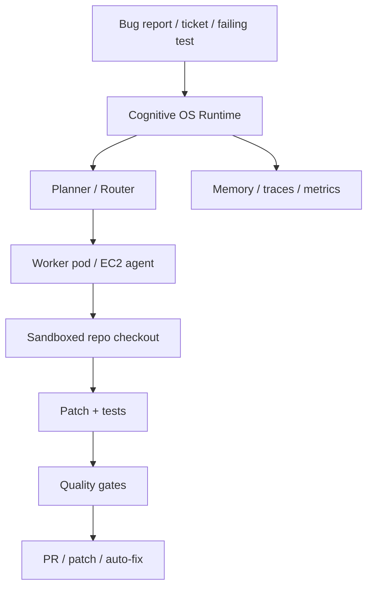

# Session Handoff — 2026-05-05 — Headless Docker Service Runtime

> Docker/headless service proof added for Cognitive OS runtime outside the IDE;
> provider account-backed execution remains gated by explicit auth/runtime proof.

## Headline

This session tested and documented the first practical non-IDE lane for Cognitive
OS: a Docker worker can boot, accept a queued local task, claim a lease, execute
inside a sandboxed copied workspace, and emit artifacts. This supports the
product direction where COS can be used from IDEs, local CLI, Docker service,
future pods/EC2 workers, and remote chat/control surfaces.

The same session also established an important negative proof: the Docker worker
currently does **not** inherit the host machine's Codex or Claude Code account
sessions. That is consistent with the no-credential-scraping rule. Future
provider execution needs explicit supported auth modes or a protected host
executor bridge.

## Goal

Move from “COS only works when we are inside an IDE session” toward “COS can run
as a service runtime that receives work, executes governed tasks, and reports
back,” while preserving the current IDE workflow.

Target product flow:



## What landed locally in this slice

| Artifact | Purpose |
|---|---|
| `scripts/cos-headless-service-drill` | Opt-in script that runs the Docker worker proof, auth probes, queue submit, worker execution, and drain summary. |
| `tests/integration/test_headless_service_drill.py` | Optional Docker integration wrapper gated by `COS_RUN_HEADLESS_SERVICE_DOCKER=1`. |
| `docs/09-Quality/manual-tests/headless-docker-service-runtime.md` | Manual test with commands, evidence, interpretation, and cleanup. |
| `docs/09-Quality/root/testing.md` | Documents the new optional Docker lane flag. |

## Validation evidence captured

### Docker and host capability

```bash
docker --version
# Docker version 29.4.0, build 9d7ad9f

docker compose version
# Docker Compose version v5.1.2
```

### Host auth probes

```bash
scripts/cos-auth-probe --provider codex --mode account-session --json
# status=ready
# command="codex login status"
# credential_store_access=forbidden

scripts/cos-auth-probe --provider claude --mode account-session --json
# status=unsupported
# reason="claude CLI not found on PATH"
```

### Docker worker self-test

```bash
COS_WORKSPACE="$TMP" docker compose -f docker/cos-worker/docker-compose.yml run --rm cos-worker --self-test
# cos-worker self-test passed; audit=/workspace/.cognitive-os/runtime/agent-audit-trail.jsonl
```

### Docker auth probes

```bash
COS_WORKSPACE="$TMP" docker compose -f docker/cos-worker/docker-compose.yml run --rm cos-worker \
  scripts/cos-auth-probe --provider codex --mode account-session --json
# status=unsupported, reason="codex CLI not found on PATH"

COS_WORKSPACE="$TMP" docker compose -f docker/cos-worker/docker-compose.yml run --rm cos-worker \
  scripts/cos-auth-probe --provider claude --mode account-session --json
# status=unsupported, reason="claude CLI not found on PATH"
```

### Docker local task proof

```bash
COS_WORKSPACE="$TMP" docker compose -f docker/cos-worker/docker-compose.yml run --rm cos-worker \
  scripts/cos-task-submit --kind local-command \
  --task-id task-docker-headless-proof \
  --command 'printf service-ok > result.txt' \
  --json
# status=submitted

COS_WORKSPACE="$TMP" docker compose -f docker/cos-worker/docker-compose.yml run --rm cos-worker \
  scripts/cos-worker-run-once --worker-id docker-proof-worker --json
# status=completed

COS_WORKSPACE="$TMP" docker compose -f docker/cos-worker/docker-compose.yml run --rm cos-worker \
  scripts/cos-queue-drain --json
# counts.completed=1
```

### New drill script

```bash
scripts/cos-headless-service-drill --json --keep-workspace
# ok=true
# host_codex_status=ready
# host_claude_status=unsupported
# container_codex_status=unsupported
# container_claude_status=unsupported
# local_task_status=completed
```

### Automated tests

```bash
python3 -m pytest tests/integration/test_headless_service_drill.py -q
# 1 skipped without COS_RUN_HEADLESS_SERVICE_DOCKER=1

python3 -m pytest tests/contracts/test_optional_docker_lanes.py -q
# 2 passed

COS_RUN_HEADLESS_SERVICE_DOCKER=1 python3 -m pytest tests/integration/test_headless_service_drill.py -q
# 1 passed in 17.60s
```

## Provider execution attempt

A host Codex provider smoke was attempted with `--allow-provider-call` against a
disposable `/tmp` workspace. The official Codex CLI auth probe returned ready
and the adapter invoked `codex exec`, but the call failed:

```text
provider_calls=1
status=failed
returncode=1
message="The 'gpt-5.5' model requires a newer version of Codex. Please upgrade to the latest app or CLI and try again."
```

Interpretation: the service adapter reached the official CLI and produced
artifacts, but provider-backed agent work is not proven until Codex CLI is
upgraded/aligned or a supported model/config is selected. Claude Code execution
was not attempted because the `claude` CLI is not installed on PATH.

## Current reality matrix

| Capability | Status | Evidence |
|---|---|---|
| Continue using COS in IDEs | Preserved | No changes remove existing harness projection. |
| Docker worker boot | Proven | `--self-test` passed. |
| Docker local-command task | Proven | queue submit, lease, worker, artifacts, drain completed. |
| Host Codex account-session probe | Proven | `status=ready`, no credential-store read by COS. |
| Docker inheriting host Codex account | Not supported by default | container probe `unsupported`, no CLI mounted. |
| Host Codex provider task | Attempted but failed | CLI model/version mismatch. |
| Host Claude Code provider task | Not available here | `claude CLI not found on PATH`. |

## Next implementation order

1. Fix Codex provider proof by upgrading/alignment or selecting an available
   model/config for `codex exec`.
2. Add an explicit host-executor bridge mode if we want Docker `cosd` to dispatch
   to host-authenticated CLIs without mounting credential stores into containers.
3. Add `waiting_for_human`/question protocol from ADR-162 into the queue runtime.
4. Add worktree/branch/PR proposal adapter for feature/bugfix development flows.
   report status, not direct execution.
6. Keep Docker provider smoke opt-in/cost-bearing; default CI should only run the
   skip check or local-command proof when explicitly requested.

## Relevant files

- `scripts/cos-headless-service-drill`
- `docker/cos-worker/docker-compose.yml`
- `scripts/cos-task-submit`
- `scripts/cos-worker-run-once`
- `scripts/cos-queue-drain`
- `scripts/cos-auth-probe`
- `docs/09-Quality/manual-tests/headless-docker-service-runtime.md`
- `tests/integration/test_headless_service_drill.py`
- `docs/09-Quality/root/testing.md`
