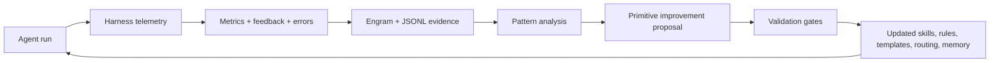

# Agent Training Harness

> Canonical contract for how Cognitive OS "trains" coding agents through harness telemetry, memory, evals, and governed updates to agentic primitives.

## Position

Cognitive OS does **not** train model weights inside the harness. In this repository, "training agents" means **operational learning**: every agent run emits evidence, the harness turns repeated evidence into patterns, and maintainers improve the agent-facing primitives that shape future runs.

The trainable surface is therefore:

- skills and their instructions;
- rules and contextual triggers;
- prompt templates and acceptance-criteria scaffolds;
- model-routing and resource-governance tables;
- memory retrieval conventions in Engram;
- eval fixtures, scorecards, and run manifests.

This keeps the OS portable across providers and IDE harnesses. A Claude, Codex, OpenCode, Shell/CI, or future harness may expose different runtime capabilities, but the learning contract remains the same: capture evidence, classify patterns, propose primitive changes, validate, then feed the new contract into later runs.

## Non-goals

The harness training loop is not:

- fine-tuning or reinforcement learning over provider model weights;
- silent mutation of project source code in the name of learning;
- automatic adoption of unreviewed rules, hooks, or skills;
- self-judged evals where the model-under-test grades itself by default;
- a claim that every projected harness has identical enforcement power.

When model fine-tuning, RL, or external trajectory datasets become relevant, they must be designed as separate provider-specific or research workflows. They cannot be implied by the core harness training contract.

## Loop



The loop follows the repository's MAPE-K framing:

| Phase | Harness training meaning | Typical evidence |
|---|---|---|
| Monitor | Capture task outcomes and runtime signals. | `skill-metrics.jsonl`, `error-learning.jsonl`, `prompt-captures.jsonl`, `session-learnings.jsonl` |
| Analyze | Detect recurrence, degradation, drift, and missing context. | error fingerprints, skill feedback, KPI regressions, user corrections |
| Plan | Convert evidence into concrete primitive-change proposals. | `/error-analyzer`, `/self-improve`, `/model-optimizer`, ADRs or plans for risky changes |
| Execute | Apply reviewed changes to skills, rules, prompts, routing, or eval fixtures. | repository diffs under `skills/`, `rules/`, `templates/`, `manifests/`, `docs/` |
| Knowledge | Persist the result for future sessions and harnesses. | Engram observations, KPI snapshots, run manifests, docs, regression tests |

## Data sources

The training harness consumes these evidence streams:

- **Task and skill metrics**: success, duration, token use, model selection, trust scores, retry count.
- **Error learning**: test, lint, build, compilation, and verification failures with fingerprints for recurrence detection.
- **Session learning**: end-of-session summaries, failed/changed skills, auto-refine iterations, and notable observations.
- **Human feedback**: user corrections, rejected outputs, review findings, and explicit preferences.
- **Eval artifacts**: scorecards, fixtures, run manifests, judge attribution, and calibration status.
- **Memory**: Engram decisions, patterns, bugs, discoveries, and prior KPI reports.

No single stream is authoritative on its own. Promotion from observation to policy requires repeated evidence or explicit maintainer judgment.

## Improvement targets

Operational learning may produce these changes:

1. **Skill updates** — rewrite instructions, add examples, improve trigger language, or retire misleading steps.
2. **Rule updates** — tighten governance where repeated failures show a missing invariant.
3. **Prompt-template updates** — improve acceptance criteria, verification wording, fallback plans, or escalation language.
4. **Routing updates** — change model/provider selection when metrics show quality, cost, or latency mismatch.
5. **Memory updates** — save durable discoveries and decisions with scoped topic keys.
6. **Eval updates** — add fixtures, manifests, judge-isolation checks, or calibrated scorecards for recurring failure classes.
7. **Documentation updates** — turn tacit operating doctrine into durable docs before relying on it in future sessions.

Project source changes are not considered "training" changes unless they are explicit product work. The harness may suggest source fixes, but the self-improvement loop primarily modifies the OS primitives that guide agents.

## Governance

The default policy in `cognitive-os.yaml` keeps self-improvement enabled but does not silently apply risky changes:

```yaml
self_improvement:
  enabled: true
  auto_apply: false
```

Safe, low-blast-radius changes can be proposed as normal docs/template/skill patches. Risky changes require stronger review:

- hook behavior changes require targeted hook tests;
- rule changes require trigger and compact-rule consistency checks;
- skill changes require frontmatter and routing checks;
- eval changes require judge isolation and content-addressed fixture/run evidence;
- routing changes require before/after quality, cost, or latency evidence.

In reconstruction phase, maintainers may rewrite broken patterns quickly, but the acceptance criteria still need to state how the training claim was verified.

## Evals and judge isolation

The harness training loop treats evals as training signal, not as proof by themselves. Default eval policy should avoid self-judging: the system-under-test and the judge should be different models/providers unless an operator explicitly opts into self-eval for a smoke run.

Longer term, each eval run should emit a content-addressed manifest that records:

- model-under-test;
- judge model or judge ensemble;
- fixture digests;
- rubric version;
- calibration status;
- budget limits and inconclusive results;
- mandatory vetoes or safety failures.

This keeps training evidence reproducible and prevents agents from improving against invisible or drifting tests.

## Acceptance criteria for training changes

Any change claiming to "train", "teach", "improve", or "self-improve" an agent must include acceptance criteria matching the changed surface:

1. The changed primitive is named: skill, rule, hook, template, routing, memory, eval, or doc.
2. The evidence source is named: metrics file, Engram observation, eval artifact, user correction, or test result.
3. The validation command or manual proof is listed.
4. The rollback path is obvious for risky changes.
5. The claim avoids implying provider-weight training unless that is actually implemented.

## Cross-links

- `docs/00-MOCs/entrypoints/overview.md` — product-level self-improvement loop.
- `docs/04-Concepts/architecture.md` — MAPE-K runtime architecture.
- `docs/04-Concepts/root/self-improvement-loop.md` — implementation guide for failure-driven self-improvement.
- `skills/agent-kpis/SKILL.md` — KPI dashboard and trend persistence.
- `skills/self-improve/SKILL.md` — self-improvement procedure.
- `rules/self-improvement-protocol.md` — governance rule for proposed improvements.
- `docs/03-PoCs/research/ifixai-annex-e-primitives-2026-05-11.md` — planned eval judge-isolation and per-run manifest primitives.
