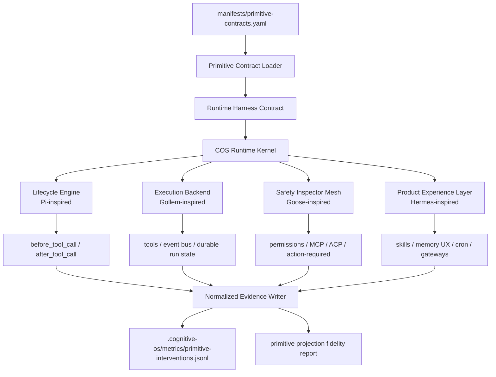

# COS Native Runtime Harness Design

Date: 2026-05-14

This document defines a COS-owned runtime/harness architecture that combines the
best patterns observed in Pi, Gollem/Fugue, Goose, and Hermes Agent without
making any of them the source of truth for Cognitive OS primitives.

## Decision

Build a COS-native runtime harness, not a direct dependency pile of four runtimes.

```text
COS primitive contracts
  -> COS Runtime Harness Contract
  -> COS Runtime Kernel
  -> optional candidate adapters/proofs
  -> normalized COS evidence
  -> primitive projection fidelity report
```

The four inspected systems become design inputs:

| Source | Pattern COS should adopt | What COS must not adopt blindly |
|---|---|---|
| Pi | Clear lifecycle model: `beforeToolCall`, `afterToolCall`, turn/session/compaction/resource events. | Pi tool/resource definitions as COS primitive source of truth. |
| Gollem / Fugue | Go-style embedded backend: typed tools, approval callbacks, event bus, durable runs, traces, codetools. | Static runtime composition that lets stale generated primitives linger. |
| Goose | Safety/interoperability: inspectors, permissions, MCP/ACP, action-required UX, session/extension state. | Goose as a parallel governance platform replacing COS contracts. |
| Hermes Agent | Product UX: memory, skills, self-improvement, cron, gateways, long-running agent ergonomics. | Hermes product/personality/memory model replacing COS governance and Engram. |

## Why not just use one of them?

Because each candidate is strong at a different layer:

```text
Pi              -> lifecycle harness
Gollem / Fugue  -> embedded service/runtime substrate
Goose           -> safety/interoperability harness
Hermes          -> product/UX harness
```

COS needs all four qualities, but the source of truth must remain:

```text
manifests/primitive-contracts.yaml
```

A runtime artifact is a compiled projection, not the primitive itself.

## Architecture



## Core modules

### 1. Primitive Contract Loader

Reads `manifests/primitive-contracts.yaml` and produces runtime-ready contracts.

Responsibilities:

- load primitive id, family, source, lifecycle trigger, required inputs, actions,
  evidence ledgers, and per-target fidelity;
- reject unsupported or incomplete contracts before runtime projection;
- expose contracts by lifecycle event and by tool intent;
- emit a manifest hash for reproducibility.

Suggested path:

```text
lib/runtime_harness/contracts.py
# or packages/runtime-harness/src/contracts.ts/go
```

### 2. Runtime Harness Contract

The COS-owned interface every backend/projection must satisfy.

```yaml
schema_version: runtime-harness-contract.v1
lifecycle:
  before_tool_call:
    required_inputs: [run_id, tool_call_id, tool_name, args, working_dir]
    decisions: [allow, block, ask, rewrite]
  after_tool_call:
    required_inputs: [run_id, tool_call_id, tool_name, args, result, is_error]
    decisions: [allow, rewrite, mark_error, terminate]
  model_request:
    decisions: [allow, rewrite_context, block]
  model_response:
    decisions: [observe, rewrite, compact]
  session_start:
    decisions: [observe, inject_context]
  session_end:
    decisions: [summarize, persist]
  compaction:
    decisions: [observe, block_until_safe, persist_checkpoint]
permissions:
  outcomes: [allow_once, allow_always, deny_once, deny_always, ask]
evidence:
  required: true
  ledger: .cognitive-os/metrics/primitive-interventions.jsonl
```

### 3. Lifecycle Engine — Pi-inspired

Owns the runtime lifecycle vocabulary:

- `before_tool_call`;
- `after_tool_call`;
- `turn_start` / `turn_end`;
- `model_request` / `model_response`;
- `session_start` / `session_end`;
- `session_before_compact` / `session_compact`;
- `resource_discover` for skills/rules/prompts.

This is the layer where COS should copy Pi's clarity.

### 4. Execution Backend — Gollem/Fugue-inspired

Owns actual work execution:

- typed tools;
- tool approval callback;
- event bus;
- run id / parent run id lineage;
- trace exporter;
- durable task/checkpoint store;
- coding tools: read, write, edit, patch, grep, bash, git, test runner;
- streamable run output.

This layer can start as Python, Go, or a thin wrapper around a Go worker. The
important part is that it is behind the COS `RuntimeHarnessContract`.

### 5. Safety Inspector Mesh — Goose-inspired

Runs before tools and provider calls.

Inspectors should be composable and evidence-producing:

```text
SecurityInspector
EgressInspector
PermissionInspector
RepetitionInspector
AdversaryInspector optional
PrimitiveContractInspector
SecretInspector
DestructiveGitInspector
ProtectedPathInspector
```

Inspector output:

```json
{
  "primitive_id": "destructive-git-blocker",
  "action": "block",
  "reason_code": "destructive_git_op",
  "confidence": 0.98,
  "finding_id": "...",
  "requires_permission": false
}
```

Permission outcomes should follow the Goose/Hermes pattern:

```text
allow_once
allow_always
deny_once
deny_always
ask
```

### 6. Product Experience Layer — Hermes-inspired

This is not the kernel. It is the outer user experience layer:

- skill browser and execution UX;
- memory/session recall UX;
- scheduled tasks / cron;
- gateway delivery;
- long-running run status;
- subagent delegation display;
- self-improvement suggestions with approval gates.

This layer should never own primitive semantics. It calls into the runtime kernel
and writes evidence through the same normalized writer.

## Normalized event model

All backends emit the same event envelope:

```json
{
  "schema_version": "runtime-event.v1",
  "timestamp": "2026-05-14T00:00:00Z",
  "run_id": "run_...",
  "parent_run_id": null,
  "session_id": "session_...",
  "event_type": "before_tool_call",
  "tool_call_id": "tool_...",
  "tool_name": "bash",
  "primitive_id": "destructive-git-blocker",
  "decision": "block",
  "reason_code": "destructive_git_op",
  "target_ref": "git-destructive-op",
  "evidence_ref": ".cognitive-os/metrics/primitive-interventions.jsonl"
}
```

## Normalized evidence model

The runtime evidence writer should keep the existing COS ledger shape compatible
with `primitive_projection_fidelity.py`:

```json
{
  "schema_version": "primitive-intervention.v1",
  "timestamp": "2026-05-14T00:00:00Z",
  "session_id": "session_...",
  "tool_use_id": "tool_...",
  "primitive_family": "hook",
  "harness": "cos-runtime",
  "primitive_id": "destructive-git-blocker",
  "primitive_source": "hooks/destructive-git-blocker.sh",
  "action_kind": "block",
  "reason_code": "destructive_git_op",
  "target_ref": "git-destructive-op",
  "source_metric": ".cognitive-os/metrics/git-op-blocks.jsonl"
}
```

## Adapter/proof strategy

The native runtime can have optional adapters, but each adapter is a proof target,
not the canonical runtime definition.

| Adapter | Purpose | First proof |
|---|---|---|
| Pi adapter | Validate lifecycle equivalence. | `destructive-git-blocker` via `beforeToolCall`. |
| Gollem worker | Validate embedded backend feasibility. | Safe edit + test + destructive command block + stream. |
| Goose adapter | Validate inspector/permission equivalence. | COS primitive as Goose-style inspector/action-required decision. |
| Hermes benchmark | Validate product UX. | Skill/memory/cron flow using COS contracts as truth. |

## First implementation slice

Start with one primitive:

```text
destructive-git-blocker
```

Acceptance criteria:

1. Contract loads from `manifests/primitive-contracts.yaml`.
2. Runtime harness exposes `before_tool_call`.
3. A bash command `git reset --hard` is blocked before execution.
4. The block writes `primitive-interventions.jsonl`.
5. The report marks the runtime proof as enforced, not structural-only.
6. Pi/Gollem/Goose/Hermes benchmark proofs can emit the same normalized row.

## Proposed files

```text
manifests/runtime-harness-contract.yaml
lib/runtime_harness/
  __init__.py
  contracts.py
  events.py
  decisions.py
  inspectors.py
  evidence.py
  kernel.py
scripts/cos-runtime-harness-smoke.py
docs/06-Daily/reports/runtime-harness-smoke-latest.json
docs/06-Daily/reports/runtime-harness-smoke-latest.md
tests/contracts/test_runtime_harness_contract.py
tests/behavior/test_runtime_harness_destructive_git.py
```

If the Go backend path is chosen:

```text
packages/runtime-worker-go/
  cmd/cos-runtime-worker/
  internal/harness/
  internal/tools/
  internal/events/
  internal/evidence/
```

## Why this is better than direct integration

Direct integration risk:

```text
COS core imports Pi + Gollem + Goose + Hermes
  -> dependency and ontology explosion
  -> four sources of primitive truth
  -> unclear evidence and fidelity semantics
```

COS-native harness:

```text
COS contracts stay canonical
candidate patterns become implementation choices
all evidence stays normalized
adapters can be swapped or removed
```

## Decision rule

A candidate feature can enter COS only if it can be expressed as one of:

1. lifecycle event;
2. inspector decision;
3. permission outcome;
4. tool execution event;
5. session/checkpoint event;
6. product UX surface that calls into the runtime kernel;
7. normalized evidence row.

If it cannot fit this model, it remains a reference pattern, not a runtime
primitive.

## Bottom line

Build a COS-owned runtime harness that **combines the ideas** of the four:

```text
Pi lifecycle clarity
+ Gollem/Fugue embeddable execution backend
+ Goose safety/interoperability inspectors
+ Hermes product UX loops
= COS Native Runtime Harness
```

The integration boundary remains:

```text
manifests/primitive-contracts.yaml
```

not Pi, not Gollem, not Goose, and not Hermes.
