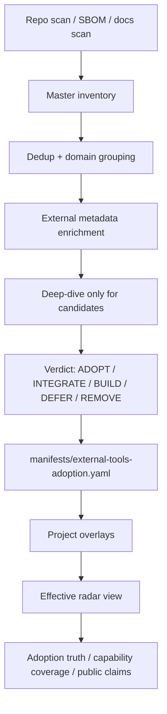

# External Tool Intelligence Plane and Project Overlays

## Conclusion

Consumer projects should not each replicate a full deep-research structure for
external tools. That would create noise, duplicated analysis, and drift between
projects.

The intended structure is:

```text
COS repo          = central intelligence / deep radar / doctrine / benchmarks
Consumer project = lightweight overlay / local evidence / local constraints
Final view       = COS radar + project overlay + real receipts
```

In other words: Cognitive OS maintains the reusable knowledge base. Consumer
projects only declare what they use, what they need, their constraints, and the
local evidence that proves a tool is actually integrated.

This keeps external-tool intelligence reusable without pretending that the OS
can know every consumer project's local context.

## External models to follow

### 1. Classic technology radar

Thoughtworks frames a technology radar as a governance tool with rings such as
`Hold`, `Assess`, `Trial`, and `Adopt`, and quadrants such as Tools, Platforms,
Techniques, and Languages & Frameworks. The important operational lesson is that
moving something into Trial or Adopt should require real use and evidence, not
enthusiasm alone.

Source: [Thoughtworks — Build Your Own Technology Radar](https://www.thoughtworks.com/en-au/insights/blog/build-your-own-technology-radar)

Zalando's public Tech Radar uses a similar ring model and is explicit that Trial
means practical experience in projects, while Adopt requires confidence at
scale.

Source: [Zalando Tech Radar](https://opensource.zalando.com/tech-radar/)

### 2. Backstage Tech Radar

Backstage/Spotify treats a tech radar as a central standards and visibility
surface. Multiple radars can exist, but the point is centralizing decisions and
making standards discoverable, not asking every repository to recreate deep
research from scratch.

Source: [Backstage Tech Radar Plugin](https://backstage.spotify.com/partners/spotify/plugin/techradar/)

### 3. Supply-chain and SBOM standards

CycloneDX, SPDX, and SBOM workflows solve a different problem: a verifiable
inventory of what components are actually present. They are excellent inputs for
"what do we use?" but do not decide "what should we adopt?" on their own.

Source: [CycloneDX capabilities](https://cyclonedx.org/capabilities/)

### 4. Health, security, and provenance metadata

OpenSSF Scorecard, deps.dev, OSV, and SLSA provide external signals about
maintenance, security, vulnerabilities, dependency health, and provenance. These
signals should enrich COS decisions, but they do not replace architectural
judgment about footprint, governance boundaries, user experience, or product
semantics.

Sources:

- [OpenSSF Scorecard](https://github.com/ossf/scorecard)
- [deps.dev API](https://docs.deps.dev/api/v3/)
- [SLSA](https://slsa.dev/)

## COS repository structure

The OS repository owns the deep research and reusable adoption intelligence:

```text
docs/06-Daily/reports/external-tools-radar-INDEX.md
docs/06-Daily/reports/external-tools-radar-YYYY-MM-DD.md
docs/06-Daily/reports/external-tools-master-inventory-YYYY-MM-DD.{md,json}
docs/06-Daily/reports/external-tools-reassessment-scope-YYYY-MM-DD.{md,json}
docs/06-Daily/reports/external-tools-deep-dive/{tool-id}.md
docs/04-Concepts/architecture/external-tool-adoption-doctrine.md
docs/04-Concepts/architecture/external-tool-adapter-taxonomy.md
manifests/external-tools-adoption.yaml
```

The missing machine-readable piece is `manifests/external-tools-adoption.yaml`.
It should make adoption decisions auditable by tools rather than scattered only
through prose.

Example shape:

```yaml
schema_version: external-tools-adoption/v1

tools:
  - id: fastmcp
    name: FastMCP
    domain: mcp
    verdict: INTEGRATE
    adoption_kind: dependency
    license: Apache-2.0
    source_of_truth:
      radar_report: docs/06-Daily/reports/external-tools-radar-full-reassessment-2026-05-08.md
      deep_dive: docs/06-Daily/reports/external-tools-deep-dive/fastmcp.md
    allowed_surfaces:
      os_repo: true
      consumer_projects: optional
      service_mode: optional
      docker_runtime: optional
    consumer_contract:
      required_adapter: true
      public_claim_allowed: partial
    evidence:
      tests:
        - tests/unit/test_cos_mcp_server.py
      consumers:
        - packages/mcp-server/cos_mcp.py
    status: active
```

## Consumer project overlay

Each consumer project should have a lightweight overlay instead of a full radar.
The overlay records local constraints, local enablement, and receipts.

Example path:

```text
.cognitive-os/external-tools-overlay.yaml
```

Example shape:

```yaml
schema_version: cos-project-tool-overlay/v1

inherits:
  from_os_radar: true
  os_version: v0.27.x

project_constraints:
  no_daemons: true
  no_network_default: true
  allowed_licenses: [MIT, Apache-2.0, BSD-3-Clause]

local_tools:
  - id: semgrep
    source: os-radar
    local_status: enabled
    reason: security scanning in CI
    evidence:
      config: .semgrep.yml
      ci_job: security-scan

  - id: custom-internal-tool
    source: project-only
    local_status: assess
    requires_deep_research: true
```

Rules:

1. If the tool already exists in the COS radar, the project only references it
   and adds local evidence.
2. If the tool is project-only, the project may keep it local or propose it for
   promotion into the COS radar if it is reusable.
3. If the project contradicts the COS verdict, the project must declare an
   override with reason, owner, expiry, and evidence.

## Recommended flow



## Three-layer rule

| Layer | Owner | Content |
|---|---|---|
| Research base | COS | Deep research, doctrine, external comparisons, benchmarks |
| Adoption manifest | COS | Machine-readable verdict, status, evidence, constraints |
| Project overlay | Consumer project | Real usage, local constraints, receipts, exceptions |

This separation avoids two failure modes:

1. Every consumer project recreates deep research and drifts from the OS.
2. The OS pretends to know local project context that only the consumer project
   can prove.

## Design implications

Future implementation work should add:

1. `manifests/external-tools-adoption.yaml` as the central adoption ledger.
2. `.cognitive-os/external-tools-overlay.yaml` as the consumer project template.
3. `scripts/cos-tool-adoption-audit` to join the OS manifest with project
   overlay, dependency files, SBOMs, and receipts.
4. `scripts/cos-tool-radar-render` to render OS-only, project-only, and combined
   views.
5. `scripts/cos-tool-research-check` to block new dependencies unless license,
   footprint, adoption kind, source links, test plan, and rollback path are
   declared.

The implementation should reuse existing COS primitives where possible:

- ADR-217 adoption truth for detecting claimed-vs-real integrations.
- ADR-252 capability coverage for linking feature claims to implementation,
  tests, receipts, and audits.
- The external-tool adoption doctrine for build-vs-adopt decisions.
- The adapter taxonomy for dependency, CLI adapter, schema port, algorithm port,
  testdata vendor, operator-installed, and pattern-only choices.
