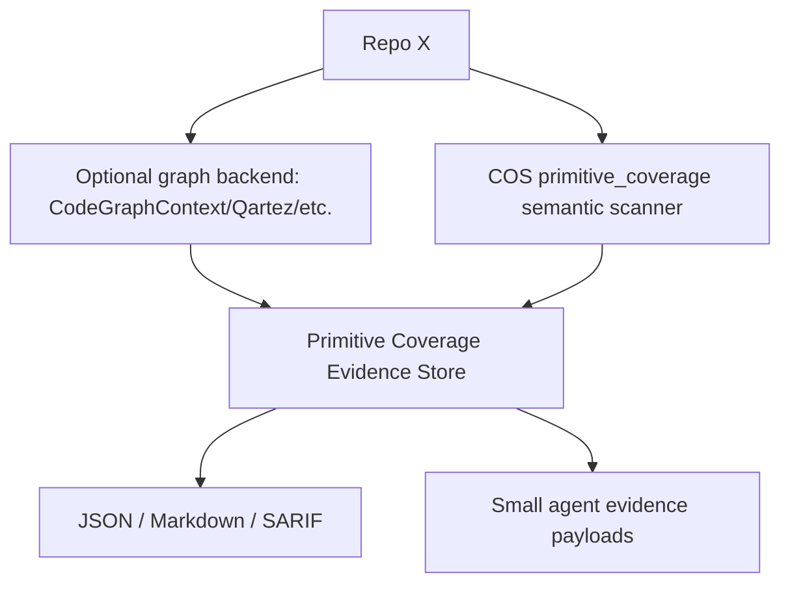

# Primitive Coverage Backend Benchmark Research — 2026-05-01

## Executive Summary

We need a local/offline intelligence layer that lets agents answer questions about
agentic primitives without loading an entire repository into the context window.
The community tools reviewed here are useful, but none is a turnkey replacement
for COS primitive coverage.

Conclusion:

- Keep `primitive_coverage/` as the COS semantic layer for skills, hooks, rules,
  docs, workflows, runtime logs, and proof links.
- Add external graph backends only as optional indexers below that layer.
- `CodeGraphContext` is the safest first spike because it is MIT-licensed and
  local/MCP-oriented.
- `Qartez` and `jCodeMunch` are relevant token-efficiency/code-intelligence
  references, but both require license/commercial review before integration.
- `Repowise` is conceptually closest for graph + git + docs + decisions, but its
  AGPL license blocks embedding under the current repo license gate; treat it as
  evaluation-only unless legal approves a boundary.

Generated benchmark outputs:

- JSON: [`docs/06-Daily/reports/primitive-coverage-backend-benchmark-2026-05-01.json`](../reports/primitive-coverage-backend-benchmark-2026-05-01.json)
- Markdown: [`docs/06-Daily/reports/primitive-coverage-backend-benchmark-2026-05-01.md`](../reports/primitive-coverage-backend-benchmark-2026-05-01.md)
- Harness: [`scripts/primitive_backend_benchmark.py`](../../scripts/primitive_backend_benchmark.py)
- Tests: [`tests/unit/test_primitive_backend_benchmark.py`](../../tests/unit/test_primitive_backend_benchmark.py)

## Problem

The question is not merely “can a tool index source code?” COS needs coverage for
agentic primitives:

- skills in `skills/`
- hooks in `hooks/` and hook registration files
- rules in `rules/` and compact rule indexes
- agents, squads, workflows, scripts, docs, claims, ADRs, and runtime metrics

The agent should receive a compact evidence answer such as:

> “This skill/hook/rule already summarizes files X/Y/Z; query it instead of
> reading the raw code.”

That requires a primitive graph, not just a symbol graph.

## Benchmark Questions

Each candidate is scored against these questions:

1. Does it detect `skills/`, `hooks/`, and `rules/` as first-class entities, or
   only as files/symbols?
2. Can it answer “which primitive avoids reading X files?”
3. Can it detect scripts/primitives with no consumers?
4. Can it detect stale documentation?
5. Can it emit JSON/SARIF useful in CI?
6. How many tokens does it save versus grep/read-all workflows?
7. Does it run local/offline?
8. Is the license compatible with COS?
9. Can it integrate as a backend for `primitive_coverage/` without rewriting the
   framework?

## Candidates

| Candidate | Repo | Why included | Initial constraint |
|---|---|---|---|
| Qartez | <https://github.com/kuberstar/qartez-mcp> | Rust MCP code-intelligence server, tree-sitter, PageRank/blast-radius, strong token-savings claims. | Custom dual/commercial license. |
| jCodeMunch MCP | <https://github.com/jgravelle/jcodemunch-mcp> | Python MCP server focused on compact source exploration and token-efficient MUNCH output. | Dual-use/non-commercial/commercial license. |
| Repowise | <https://github.com/repowise-dev/repowise> | Graph + git + docs + decision intelligence; closest conceptual overlap with COS docs/decision coverage. | AGPL-3.0; blocked for embedding. |
| CodeGraphContext | <https://github.com/CodeGraphContext/CodeGraphContext> | MIT local/MCP graph backend with CLI; strongest license fit. | Graph backend only; no primitive semantics out of box. |

## Local Benchmark Protocol

The first benchmark is intentionally a metadata/protocol benchmark:

1. Clone candidates outside the repo under `/tmp/cos-code-intel-candidates`.
2. Inspect README, LICENSE, and package metadata.
3. Do not vendor, import, or install candidate code by default.
4. Score candidates using the COS question matrix.
5. Emit JSON and Markdown under `docs/06-Daily/reports/`.
6. Keep the benchmark dependency-free so it can run in CI.

This avoids contaminating the repository with AGPL/custom-licensed code and
separates “interesting product” from “safe backend dependency.”

## Findings

| Candidate | Finding |
|---|---|
| Qartez | Strong code graph/token-saving candidate. It can likely support consumer-gap detection through references/blast-radius, but COS would still need a primitive adapter. License review required. |
| jCodeMunch MCP | Useful as a compact retrieval reference. It is weaker for consumer-gap/stale-doc analysis from the inspected docs and requires license review. |
| Repowise | Best conceptual fit for docs/decisions plus code graph, but AGPL blocks embedding. Use as benchmark/reference only unless legal clears a separate-process or commercial path. |
| CodeGraphContext | Best first integration spike because license is MIT and it exposes local graph/MCP/CLI primitives. It still needs COS-specific extraction for skills/hooks/rules/docs. |

## Integration Direction

Use a layered architecture:

The external backend should answer symbol/file/reference questions. COS should
own primitive semantics:

- primitive families and IDs
- registered vs declared status
- doc claim/proof links
- runtime-seen metrics
- actionable gaps
- stale/duplicated/aspirational documentation classification

## Recommendation

1. Treat this benchmark as the guardrail before adding any backend.
2. Spike `CodeGraphContext` first as a local graph adapter only.
3. Keep Qartez/jCodeMunch in a license-review backlog.
4. Keep Repowise as “evaluate only” until license/legal strategy changes.
5. Continue emitting COS-owned JSON/Markdown/SARIF so CI and agents do not depend
   on a vendor-specific output format.

## Acceptance Criteria

- `python3 -m pytest tests/unit/test_primitive_backend_benchmark.py -q` passes.
- `python3 scripts/primitive_backend_benchmark.py --candidates-dir /tmp/cos-code-intel-candidates --project-dir .` emits JSON and Markdown reports.
- The benchmark makes license incompatibility visible rather than hiding it under
  product-quality scores.
- No candidate source code is copied into this repository.
