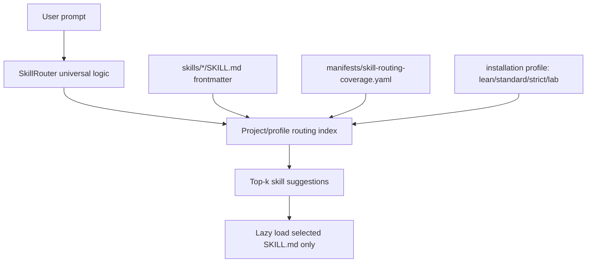

# Profile-Aware Skill Routing and Lazy Context Loading

Date: 2026-05-05  
Status: Active architecture note  
Related: ADR-174, `manifests/skill-routing-coverage.yaml`, `tests/contracts/test_skill_router_profile_contracts.py`

## Summary

Cognitive OS uses a universal `SkillRouter` implementation, but it must not use a
single global visible skill index for every runtime. The router logic is shared;
the routing index is scoped by project, installation profile, and runtime
surface.

This protects two goals at the same time:

1. **No silent primitive drift** — new skills must be routeable or explicitly
   classified as non-routeable.
2. **Token compression** — agents receive compact skill suggestions and only load
   full `SKILL.md` bodies when a skill is actually invoked.

## Boundary: primitive vs. ADR record

- `skills/adr-tombstone/`, `scripts/adr_tombstone.py`, and related tests are an
  agentic primitive.
- `docs/02-Decisions/adrs/ADR-NNN-tombstone.md` files are ADR records generated or repaired by
  that primitive.

Do not treat ADR records themselves as agentic primitives.

## Routing architecture



The router reads `routing_patterns:` from `SKILL.md` frontmatter and filters the
resulting index through profile declarations in
`manifests/skill-routing-coverage.yaml`.

## Profiles

The canonical runtime profiles are:

| Profile | Aliases | Purpose |
|---|---|---|
| `lean` | `default`, `core` | Minimal consumer-project surface |
| `standard` | `core+team`, `default+team-extensions` | Normal team install |
| `strict` | `full`, `core+team+maintainer` | Maximum governed install |
| `lab` | `opt-in` | Experimental/opt-in surface |

`SkillRouter(project_root=..., profile=...)` must include only skills projected
for that profile when profile routing metadata exists.

## New skill invariant

A new `SKILL.md` must satisfy one of these conditions:

1. It has `routing_patterns:` frontmatter.
2. It is already routeable through the router fallback table.
3. It is explicitly listed in `unrouted_skill_allowlist` with a rationale.
4. It declares explicit non-routeable metadata such as `routing.class` with a
   rationale.

A skill must not silently appear on disk without routeability or classification.

## Service runtime cache

For Cognitive OS running as a service, routing is cached by:

```text
project_root + profile + checksum(all SKILL.md files)
```

Any `SKILL.md` edit changes the checksum and invalidates the cached router. This
prevents long-running service processes from serving stale routing patterns.

Implemented by `SkillRoutingIndexCache` in `lib/skill_router.py`.

## Lazy catalog/token compression contract

The compact catalog is allowed to contain only metadata-level summaries. It must
not contain full skill bodies, procedural sections, or large examples.

Expected flow:

```text
prompt -> profile-aware router -> top-k skill suggestions -> load chosen SKILL.md
```

Not allowed:

```text
session start -> load every SKILL.md body into context
```

`tests/contracts/test_skill_router_profile_contracts.py` enforces that
`skills/CATALOG-COMPACT.md` stays smaller than `skills/CATALOG.md` and does not
contain full-body sentinel sections.

## Enforced contracts

The following contracts protect this architecture:

| Test | Guarantee |
|---|---|
| `test_new_skills_require_routing_metadata` | New skills cannot silently join the routing backlog. |
| `test_projected_skills_are_routeable_by_profile` | Every skill visible in a profile is routeable in that profile. |
| `test_router_index_excludes_unprojected_skills` | Profile routers do not leak skills outside their projected surface. |
| `test_service_router_cache_invalidates_on_skill_md_checksum` | Service router cache refreshes after `SKILL.md` edits. |
| `test_lazy_catalog_does_not_load_full_skill_bodies` | Compact catalog remains metadata-only. |

## Current state

As of this note:

- Main worktree global coverage: 185 skills on disk, 160 routeable, 25 backlog.
- Secondary worktree branch coverage differs because that branch has an older
  routing migration state, but it has the same forward-looking contracts.

The backlog is allowed as explicit migration debt. It must not grow silently.
