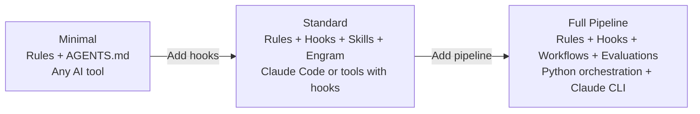
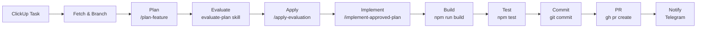

# Project Consumption Patterns

How external projects consume COS — from minimal to full pipeline.

## Three Consumption Models



### Minimal (Any Tool)
- Install: `cos init --minimal` → generates AGENTS.md + basic rules
- What you get: Behavioral rules that guide the AI, nothing enforced
- Works with: Any tool that reads AGENTS.md (14+ tools)
- Limitations: No automated governance, no memory, no quality gates

### Standard (Claude Code or Hook-Capable Tools)
- Install: `cos init --standard` → rules + 15 hooks + skills + Engram
- What you get: Automated quality gates, error learning, security scanning, persistent memory
- Works with: Claude Code (full), Cursor/Devin (with adapters)
- Limitations: No external pipeline orchestration, no CI/CD integration

### Full Pipeline (Python + Claude CLI)
- Install: `cos init --full` → everything + pipeline-runner + workflow templates
- What you get: End-to-end automated SDLC (plan → build → test → review → document → ship)
- Works with: Any tool with a CLI (Claude Code, OpenCode, Gemini CLI, etc.)
- Limitations: Requires Python, requires CLI tool, most complex to set up

## Reference Architecture: reference-project

reference-project is a Next.js e-commerce project that independently built a Full Pipeline consumption model. It demonstrates what a mature COS consumer looks like.

### Directory Structure

```
project/
├── .claude/                          # Tool-specific driver
│   ├── settings.json                 # Hooks, permissions, env vars
│   ├── agents/                       # 4 specialized subagents
│   │   ├── nextjs-architect.md       # Architecture decisions (Opus)
│   │   ├── ui-ux-reviewer.md         # Visual review via Storybook (Opus)
│   │   ├── ui-ux-architecture.md     # Component architecture (Opus)
│   │   └── qa-playwright-lead.md     # E2E test strategy (Opus)
│   ├── agent-memory/                 # Per-agent MEMORY.md files
│   ├── commands/                     # 17 slash commands
│   ├── rules/                        # 11 auto-loaded project rules
│   ├── sub-rules/                    # 114 detailed reference docs
│   └── skills/                       # 19 domain skills
├── ai/                               # AI runtime artifacts
│   ├── plans/                        # ~213 plan files (features/, ui/, chore/, bugs/, e2e/)
│   ├── agents/evaluations/           # ~125 scored evaluation reports
│   └── web-workflow/                 # Pipeline run state
└── ai-workflows/                     # Python pipeline orchestrators
    ├── web_feature_pipeline.py       # 11-phase feature pipeline
    ├── web_chore_pipeline.py         # Chore pipeline
    ├── web_bug_pipeline.py           # Bug fix pipeline
    ├── web_design_system_pipeline.py # 13-phase design system pipeline
    └── lib/
        ├── agent.py                  # Claude CLI wrapper
        ├── shared_phases.py          # Reusable build/test/commit/PR phases
        └── web_state.py              # Pydantic state management
```

### Pipeline Data Flow



### Key Design Decisions

1. **Evaluate but never block**: Evaluations produce a 50-point score but the pipeline always continues. Blocking creates human bottlenecks; capturing the score enables trend analysis.
2. **Per-agent memory**: Each subagent maintains its own MEMORY.md (QA agent learns QA patterns; architect learns architecture). Engram provides cross-agent search.
3. **Python wraps Claude CLI**: Deterministic orchestration around non-deterministic AI. Each phase is a fresh Claude invocation — no context degradation.
4. **Slash commands as the API**: The boundary between Python orchestration and AI execution is slash commands. This makes the AI layer swappable.
5. **State in JSON**: `workflow_state.json` with resume/start-from support. Survives crashes.

## The Workflow Layer (from TAC Course)

IndyDevDan's Tactical Agentic Coding course defines the canonical patterns for AI workflows. COS should provide these as the framework; projects customize.

### The Four-Layer Architecture
```
Layer 4: Justfile          <- Human entry point ("just build-feature 42")
Layer 3: Commands (.md)    <- Orchestration (/plan-feature, /implement)
Layer 2: Subagents (.md)   <- Parallel workers (architect, reviewer)
Layer 1: Skills (.md)      <- Raw capabilities (feature-architecture, testing)
```
Each layer delegates downward. You can enter at any layer.

### ADW (Agent Developer Workflows) Evolution (TAC Course Progression)

| Module | Pattern | Key Addition |
|--------|---------|-------------|
| TAC-1 | `claude -p <prompt>` | CLI as building block |
| TAC-2 | Slash commands | /prime, /install, /tools |
| TAC-3 | Plan-then-implement | /feature → specs/ → /implement |
| TAC-4 | Full ADW orchestration | Python pipeline + GitHub + hooks |
| TAC-5 | Composable pipelines | Shared state JSON, modular phases |
| TAC-6 | Complete SDLC | + Review + Document + Patch retry |
| TAC-7 | Isolation + ZTE | Git worktrees + Zero Touch Execution |
| TAC-8 | Agent primitives | Raw prompt, SDK, slash command as 3 primitives |

### The 12 Leverage Points (TAC Framework)

**In Agent** (inside Claude session): Context, Model, Prompt, Tools

**Through Agent** (orchestration layer): Standard Output, Types, Docs, Tests, Architecture, Plans, Templates, AI Developer Workflows

## What COS Provides vs What Projects Build

| Concern | COS Provides | Project Builds |
|---------|-------------|----------------|
| Quality governance | Trust scores, blast radius, clarification gates, acceptance criteria | — |
| Error learning | Error capture, pattern detection, skill improvement triggers | — |
| Memory | Engram (cross-session, cross-agent, searchable) | Per-agent MEMORY.md (domain-specific learnings) |
| Common skills | code-review, plan evaluation, sdd-* phases | Domain skills (routing, auth, UI, API patterns) |
| Hook framework | 93 governance hooks (security, rate limiting, metrics) | Project-specific hooks (auto-format, pattern guards) |
| Pipeline runner | External Python orchestration framework | Pipeline variants (feature, bugfix, chore, design-system) |
| Agent templates | Architect, reviewer, QA lead (generic roles) | Domain-specialized agents (Next.js architect, Playwright lead) |
| Rules framework | 94 governance rules + RULES-COMPACT.md | Project rules (TypeScript patterns, framework conventions) |
| Config | cognitive-os.yaml (phases, quality, budget, routing) | Project config (build commands, test commands, deploy) |

## The ai/ Directory Convention

Projects should follow this standard structure for AI artifacts:

```
ai/
├── plans/                    # Generated plan documents
│   ├── features/             # Feature plans
│   ├── bugs/                 # Bug fix plans
│   ├── chores/               # Maintenance plans
│   └── {custom}/             # Project-specific categories
├── evaluations/              # Scored evaluation reports
├── reviews/                  # Code review outputs
├── docs/                     # Agent-generated documentation
└── workflow/                 # Pipeline run state
    └── {workflow-id}/
        └── state.json        # Pydantic-serialized workflow state
```

Naming convention: `{date}-{type}-{slug}.md` (e.g., `2026-04-09-feature-user-auth.md`)
