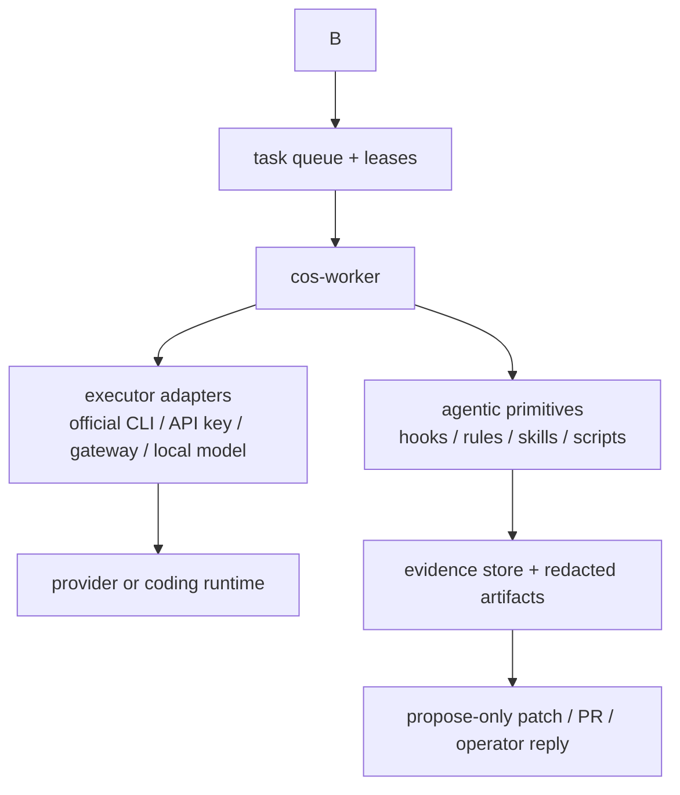

# Remote SO Control Plane Alternatives — 2026-05-05

## Question

minimal OpenClaw-like projects solve three problems that Cognitive OS will also
face once it can run outside the current IDE session:

1. connecting to model providers, model CLIs, API keys, account plans, and local
   model runtimes;
2. receiving remote operator input through Telegram/chat/web/API surfaces; and
3. keeping the SO portable without turning IDE projection into a false runtime
   support claim.

Machine-readable inventory: `manifests/remote-control-plane-alternatives.yaml`.

## Existing COS posture

The repository already has the right boundary in
`docs/04-Concepts/architecture/service-control-plane-research-2026-05-04.md` and
`docs/04-Concepts/architecture/service-control-plane-implementation-plan.md`:

- future `cosd` owns task admission, queueing, leases, worker execution, and
  evidence;
- provider adapters are separate from the scheduler;
- credential posture is explicit per adapter;
- the SO must not read `~/.claude`, `~/.codex/auth.json`, Keychain, cookies, or
  vendor token stores directly;
- account-backed CLI usage is allowed only by invoking official CLIs as black
  boxes after an `auth_probe` says the adapter is ready.

local UI/REST sink for metrics, issues, spend, agent status, and notifications.
It is useful as an operator console pattern, but it is not currently the model
provider router.

## Source verification snapshot

The listed projects were verified through GitHub repository metadata and README
content on 2026-05-05. When official docs existed, those were preferred. This
is evidence for design direction, not a claim that COS integrates with them.

| Project | Language | License posture | Remote/control pattern | Provider pattern | COS takeaway |
|---|---:|---|---|---|---|
| OpenClaw | TypeScript | allowed | Gateway with Telegram/Discord/Slack/WhatsApp/etc. | model config, auth profiles, OAuth/API keys | Strongest reference for local-first gateway + channel pairing + sandbox defaults. |
| Agent Zero | Python | review | Web UI + A0 CLI Connector to host/remote URL | Web UI/provider config, Codex OAuth direction | Strong reference for explicit host connector instead of mounting whole home dirs. |
| OpenCode current | TypeScript | allowed | TUI/CLI/web/headless HTTP server | AI SDK providers, `/connect`, custom OpenAI-compatible providers | Best executor reference: provider abstraction plus programmatic server. |
| NanoClaw | TypeScript | allowed | container-first channel modules | Anthropic Agents SDK plus Codex/OpenCode/Ollama modules | Prefer optional provider/channel adapters over bloated default installs. |
| PicoClaw | Go | allowed | WebUI + Gateway + chat channels | WebUI provider setup, API keys, OpenRouter/Ollama/vLLM | Good Go/minimal reference for explicit provider/channel onboarding. |
| ZeroClaw Labs | Rust | allowed | single-binary channels, webhooks, CLI | Anthropic/OpenAI/Ollama/provider adapters | Good Rust reference for compact gateway/provider/tool boundaries. |
| nanobot-ai/nanobot | Go | allowed | CLI/MCP agent | `llmProviders` with OpenAI/Anthropic/Azure/Bedrock/Ollama | Good MCP-provider config reference; not primarily chat ingress. |
| HKUDS nanobot | Python | allowed | Telegram/Discord/Slack/WeChat/etc. | many providers, local models, Copilot-style auth | Breadth reference; high churn requires strict proof gates. |
| TinyAGI | TypeScript | allowed | team rooms, CLI viewer, web portal, chat channels | Anthropic/OpenAI/Codex/custom compatible endpoints | Good reference for multi-agent rooms and per-provider token management. |
| Original TinyClaw | TypeScript | review | Discord-oriented | Ollama Cloud/account/API-key posture | Conceptual only until license/legal review. |
| NullClaw | Zig | allowed | tiny binary, channel health, gateway | many providers, OpenAI-compatible, local models | Strong reference for encrypted local secrets and DLP. |
| IronClaw | Rust | allowed | gateway/plugins/WASM/channel posture | NEAR AI default plus Anthropic/OpenAI/Copilot/Gemini/Ollama/OpenRouter | Good privacy/security/plugin boundary reference. |
| Pinchy | TypeScript | blocked | OpenClaw gateway + enterprise UI | Anthropic/OpenAI/Google/Ollama provider management | AGPL blocks code reuse; concept-only for audit trail/offline ideas. |
| ZeptoClaw | Rust | allowed | compact gateway/channels/webhooks/CLI | provider table, env/config keys, local models | Strong DLP/sandbox/provider matrix reference. |

## What the alternatives converge on

### Provider/model connection patterns

1. **Direct API key per provider** — Simple and portable for CI/headless, but it
   centralizes secret risk and direct model spend.
2. **OpenAI-compatible gateway/provider abstraction** — OpenCode, ZeptoClaw,
   NullClaw, PicoClaw, and others use this pattern to normalize OpenRouter,
   local servers, LiteLLM/vLLM, LM Studio, Ollama, and custom endpoints.
3. **Official account-backed CLI executor** — Agent Zero and OpenClaw both point
   toward using subscription/account products through documented flows. COS
   should only invoke official CLIs and never read their cached tokens.
4. **Local model runtimes** — Ollama, LM Studio, llama.cpp, vLLM, and similar
   runtimes reduce cloud dependency but still need capability/cost/quality
   metadata.
5. **MCP/tool gateway** — Nanobot and several *claw projects show MCP as a
   useful tool boundary, but MCP is not a substitute for queueing, auth probes,
   redaction, and leases.

### Remote communication patterns

1. **Chat gateway** — Telegram/Discord/Slack/WhatsApp are convenient but must be
   treated as untrusted ingress. Channel pairing/allowlists and output DLP are
   mandatory before any write-capable action.
   state, logs, settings, and interruptions.
3. **Headless HTTP server** — OpenCode exposes a programmatic server. This is a
   clean pattern for COS-to-executor integration when protected by explicit
   auth and localhost/default bind discipline.
4. **CLI connector** — Agent Zero's A0 connector is the closest analogue for a
   remote SO that operates on a host workspace without embedding itself in the
   IDE.
5. **Webhook/event bus** — Good for automation, but must enter the same queue,
   lease, approval, and audit trail as chat input.

## Decision direction for Cognitive OS

COS should not become an OpenClaw clone. The SO should adopt the smaller
architectural split that appears across the better alternatives:



The IDE is then only one possible ingress/executor shape. Claude Code, Codex,
Cursor, VS Code Copilot, OpenCode, and future harnesses can project local files,
but remote operation must go through `cosd` and its adapters.

## Proposed adapter taxonomy

| Layer | Adapter examples | First proof | Non-negotiable gate |
|---|---|---|---|
| Executor | `local-command`, `opencode-server`, `codex-cli-host`, `claude-cli-host` | dry-run or no-model command | `auth_probe`, no token scraping, redacted logs |
| Provider gateway | `openrouter`, `litellm`, `ollama`, `lmstudio`, `vllm` | model list or no-op request where possible | explicit credential mode and cost mode |
| Evidence | `artifact-jsonl`, `patch-bundle`, `draft-pr` | deterministic bundle on disk | no raw secrets, append-only logs |

## Phased plan

### Phase R0 — Research and contracts

- Maintain `manifests/remote-control-plane-alternatives.yaml`.
- Keep this report linked from service-control-plane docs.
- Add ADR-161 to lock the remote ingress/provider adapter boundary.

Acceptance criteria:

```bash
python3 -m pytest tests/contracts/test_remote_control_plane_alternatives.py -q
```

### Phase R1 — Local REST ingress, no provider

- Implement a local-only `cosd` admission endpoint or CLI shim.
- Submit a deterministic no-model task into the existing planned queue shape.
- Emit evidence and operator status.

Acceptance criteria:

```bash
scripts/cos-task-submit --kind local-command --command 'printf ok'
scripts/cos-worker-run-once --executor local-command --json
```

### Phase R2 — Telegram lab ingress, no autonomous writes

- Use Telegram Bot API with webhook or polling selected explicitly per install.
- Map inbound messages to queued tasks only after allowlist/pairing.
- Replies are status summaries, never raw provider logs.

Acceptance criteria:

- mocked Telegram update creates one queued task;
- replayed update is ignored;
- unauthorized chat ID receives no task execution;
- redaction catches API-key shaped output before reply.

### Phase R3 — OpenCode executor adapter

- Treat OpenCode as an executor candidate because it has provider abstraction and
  a headless HTTP server.
- First proof is local-only, localhost-bound, basic-auth protected, and can run
  dry-run/no-model checks before real credentials.

Acceptance criteria:

- `cos-auth-probe --provider opencode --mode server --json` returns
  `ready|auth_required|unsupported|unsafe`;
- no OpenCode config or token file is parsed by COS;
- stdout/stderr artifacts are redacted.

### Phase R4 — Official CLI adapters

- Add host-only adapters for Codex/Claude/Gemini/Kimi/etc. only where official
  CLIs and documented auth flows exist.
- Every adapter starts as maintainer-local/lab until account-backed runtime smoke
  is performed.

Acceptance criteria:

- adapter invokes the official binary only;
- missing binary or auth returns structured `auth_required`/`unsupported`;
- no credential path is opened by COS.

### Phase R5 — Provider gateway adapters

- Add OpenRouter/LiteLLM/Ollama/LM Studio/vLLM style adapters as explicit
  provider-gateway modes.
- Mark cost mode, credential mode, rate-limit posture, and privacy posture.

Acceptance criteria:

- provider config supports `{env:VAR_NAME}` style indirection;
- direct secrets are rejected in repository files;
- provider tests run with fake keys and mocked network by default.

## Security notes

### No credential scraping

- Chat ingress is remote code-execution pressure by another name. Unknown users,
  compromised chat accounts, prompt injection, and leaked outputs are expected
  threat models.
- The OpenClaw ecosystem's popularity makes secret exposure and malicious skill
  supply chain a realistic risk; COS must apply its existing license/security
  gates before adopting any code or pattern.
- `Pinchy` is AGPL-licensed in the verified GitHub metadata, so it is blocked for
  code reuse under current COS policy. Other projects can still require legal
  review if their license metadata is missing or ambiguous.

## Manual test checklist

Durable checklist: `docs/09-Quality/manual-tests/remote-control-plane-boundary.md`.

1. Review this report against `manifests/remote-control-plane-alternatives.yaml`.
2. Confirm no credential value appears in either artifact.
3. Confirm every remote channel is classified as ingress, not as an executor.
   owner.
5. Confirm OpenCode is framed as an executor candidate, not mandatory COS
   dependency.

## Sources

Primary sources reviewed:

- [OpenClaw GitHub](https://github.com/openclaw/openclaw)
- [OpenClaw docs](https://docs.openclaw.ai/)
- [Agent Zero GitHub](https://github.com/agent0ai/agent-zero)
- [OpenCode config docs](https://opencode.ai/docs/config/)
- [OpenCode providers docs](https://opencode.ai/docs/providers/)
- [OpenCode server docs](https://opencode.ai/docs/server/)
- [OpenCode GitHub](https://github.com/anomalyco/opencode)
- [NanoClaw GitHub](https://github.com/qwibitai/nanoclaw)
- [PicoClaw GitHub](https://github.com/sipeed/picoclaw)
- [ZeroClaw Labs GitHub](https://github.com/zeroclaw-labs/zeroclaw)
- [nanobot-ai GitHub](https://github.com/nanobot-ai/nanobot)
- [HKUDS nanobot GitHub](https://github.com/HKUDS/nanobot)
- [NullClaw GitHub](https://github.com/nullclaw/nullclaw)
- [IronClaw GitHub](https://github.com/nearai/ironclaw)
- [ZeptoClaw GitHub](https://github.com/qhkm/zeptoclaw)
- [Telegram Bot API](https://core.telegram.org/bots/api)
