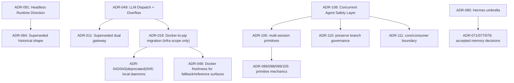

# ADR Collision Reconciliation — 2026-05-02

## Purpose

This artifact records the ADR namespace and semantic-collision cleanup performed after an audit of `docs/adrs/`.

## Acceptance criteria

1. Every non-lettered ADR filename number matches the first heading number.
2. Intentional lettered addenda remain allowed.
3. Known overlapping ADR clusters state their relationship explicitly.
4. A focused audit test prevents the concrete numbering regression from returning.

## Findings and resolutions

| Cluster | Finding | Resolution |
|---|---|---|
| ADR-086 / attempted ADR-085 | `ADR-086-hook-execution-observability.md` had an internal `# ADR-085` title. | Kept the canonical file as ADR-086, corrected the heading, and added a renumbering comment explaining the contested ADR-085 slot. |
| ADR-084 / ADR-091 | Both described headless and clustered runtime shape. | ADR-091 is canonical; ADR-084 is marked superseded and retained as historical design input. Clustered operation is a deployment topology under headless runtime, not a third top-level mode. |
| ADR-011 / ADR-018 / ADR-049 | Gateway history mixed Docker migration, LiteLLM/Bifrost removal, and provider overflow routing. | ADR-049 is canonical for LLM dispatch and overflow. ADR-018 remains canonical for Docker-to-pip/local-service migration. ADR-011 remains superseded. |
| ADR-018 / ADR-042 / ADR-043 (deprecated 2026-05-05 — see ADR-171) / ADR-045 / ADR-048 | Local daemons could read as reversing Docker-to-pip. | Local-daemon ADRs are explicitly continuations of ADR-018 phase 3. ADR-048 governs only remaining Docker fallback/reference surfaces. |
| ADR-071 / ADR-077 / ADR-078 / ADR-080 | Hermes umbrella overlapped with accepted memory ADRs. | ADR-080 is now explicit that it does not reopen accepted Engram, peer-card, or mid-task memory decisions. |
| ADR-089 / ADR-098 / ADR-099 / ADR-105 / ADR-106 / ADR-108 / ADR-110 / ADR-111 | Concurrent safety ADRs were individually reasonable but lacked hierarchy. | ADR-108 is the umbrella layer; ADR-106 is the multi-session primitive spec; ADR-110 is the preserve-branch primitive; ADR-111 is the core/consumer boundary. Lower-level ADRs own primitive mechanics. |

## Canonical hierarchy after cleanup

## Non-collisions

Lettered ADR variants such as `ADR-026a`, `ADR-027a`, `ADR-028a`, `ADR-028b`, `ADR-028c`, `ADR-029b`, `ADR-033b`, and `ADR-055b` are intentional addenda. They share a base number by convention and should not be treated as namespace collisions.

## Regression guard

`tests/audit/test_adr_contracts.py` now verifies that each non-lettered ADR filename number matches the first Markdown heading. This catches the ADR-086/ADR-085 class of error while preserving intentional lettered variants.
