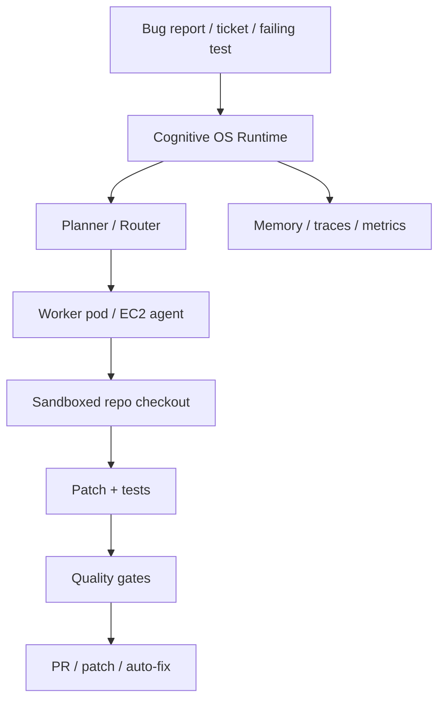

# ADR-027: Headless and Clustered Runtime Direction

- **Status**: Accepted as direction, not yet implemented as a production cluster
- **Date**: 2026-04-28
- **Decision owner**: Cognitive OS maintainers
- **Related**:
  - `docs/business/durable-product-master-plan.md`
  - `docs/architecture/bootstrap-portability.md`
  - `docs/architecture/capability-centric-runtime-enforcement.md`
  - `docs/architecture/runtime-hardcoding-discipline.md`
  - `.cognitive-os/plans/architecture/headless-clustered-runtime-plan.md`

## Context

Cognitive OS started as a local operating layer for AI coding agents, with
lifecycle hooks, rules, skills, memory, metrics, and driver projections for
harnesses such as Claude Code and Codex. That local mode remains valuable, but
it should not be the final architectural boundary.

The durable product direction is broader:

> Cognitive OS can run locally as a developer assistant, or headlessly as an
> operational runtime for AI engineering workers.

This means the same governance, verification, portability, and memory contracts
that help local coding agents should eventually govern AI workers running in CI,
VMs, containers, Kubernetes pods, and clustered repair/build systems.

## Decision

Cognitive OS will evolve toward a portable engineering-agent runtime with two
explicit modes:

1. **Local harness runtime** — the current mode, driven by local tool harnesses
   such as Codex, Claude Code, OpenCode, Cursor, Windsurf, and similar hosts.
2. **Headless runtime** — a future mode where Cognitive OS runs without an
   interactive developer harness and can accept tasks from queues, CI, tickets,
   bug reports, or product-building workflows.

The headless direction is accepted, but Cognitive OS must not claim to be
cluster-ready until the required runtime surfaces are implemented and tested.

## Scope

The target deployment surfaces are:

- laptop / developer workstation;
- EC2 or another VM;
- container;
- Kubernetes pod;
- clustered worker pool;
- CI/CD pipeline;
- automatic bug-repair system;
- feature/product factory.

## Current Enablers

The repository already contains pieces that support this direction:

- lifecycle hooks;
- Engram-backed memory and local fallback evidence;
- JSONL metrics;
- task and session state;
- queues and rate limiting;
- repair loops;
- dispatcher and provider layer;
- doctor scripts;
- install/update flows;
- self-hosting tests;
- increasing separation between `.cognitive-os/` runtime state and driver
  projections such as `.claude/` and `.codex/`.

These are necessary foundations, but they are not sufficient to claim a
clustered runtime.

## Target Flow

## Requirements Before Cluster-Ready Claims

Cognitive OS must implement and verify the following before using language such
as "Kubernetes-native autonomous repair cluster".

### Runtime Server / Worker Mode

Required commands or equivalents:

- `cos worker`
- `cos run-task`
- `cos repair`
- `cos queue-drain`

### Shared State

The runtime must support durable state outside a single local filesystem:

- Valkey for queue/cache use cases;
- Postgres or SQLite for durable coordination state;
- object storage or artifact storage for patches, logs, and test outputs;
- explicit degradation rules when a shared dependency is absent.

### Workspace Isolation

Each bug, ticket, or feature must run in an isolated workspace:

- git worktree;
- container workspace;
- ephemeral volume;
- rollback path with audit evidence.

### Queue and Scheduler

Headless execution must include:

- task admission;
- worker leasing;
- retry/backoff;
- dead-letter queue;
- cost/model/capability limits;
- idempotent recovery after worker crash.

### Provider and Capability Routing

The runtime must remain capability-centric:

- task asks for execution profile/capabilities;
- provider/model selection happens behind adapters;
- no local harness or vendor is the implicit center.

### Security Model

Required controls:

- per-task permissions;
- filesystem/network isolation;
- secrets only via environment or secret manager;
- audit trail for every privileged action;
- policy checks before patch publication.

### Observability

The runtime must expose:

- traces;
- quality gates;
- outcome metrics;
- repair success rate;
- cost and latency metrics;
- failure taxonomy.

### Kubernetes Packaging

Before claiming Kubernetes readiness, provide:

- worker deployment manifests or Helm chart;
- scheduler/queue deployment;
- shared-service configuration;
- ConfigMap/Secret boundaries;
- readiness/liveness checks;
- scale-up/down behavior tests.

## Non-Goals For Now

- Cognitive OS is not yet a production Kubernetes-native autonomous repair
  cluster.
- Cognitive OS should not make Docker, Kubernetes, Phoenix, Paperclip, or any
  UI/control-plane service mandatory for local default use.
- Cognitive OS should not move non-core subsystems into central runtime paths
  merely because they are useful in the future clustered architecture.

## Product Positioning

Approved positioning:

> Cognitive OS is evolving from a local agent operating layer into a portable
> engineering runtime that can run on developer machines, CI, VMs, and eventually
> clustered worker environments.

Future promise:

> The same operational contracts that govern local coding agents should also
> govern headless repair workers and product-building agents in cloud
> infrastructure.

Disallowed until implemented and tested:

> Cognitive OS is a Kubernetes-native autonomous repair cluster.

## Consequences

### Positive

- Provides a clear growth path beyond Claude/Codex local hooks.
- Aligns with the master plan: governable, verifiable, portable coding agents
  in real repositories.
- Prevents early vendor lock-in by requiring capability-centric routing.
- Makes EC2/container/pod execution a planned runtime target rather than an
  accidental script side effect.

### Negative / Risks

- The architecture can become over-engineered if headless features invade the
  local default path.
- Shared-state and cluster features introduce operational complexity.
- Security expectations rise sharply once the runtime can mutate repositories
  without an interactive developer.
- Product messaging must stay honest while the runtime is still local-first.

## Guardrails

- Local default remains lightweight.
- Headless/clustered features are opt-in until mature.
- `.cognitive-os/` remains the canonical runtime state center.
- Driver projections (`.claude/`, `.codex/`, etc.) remain adapters, not the
  source of truth.
- Every new headless claim needs a runnable proof path or a test.
