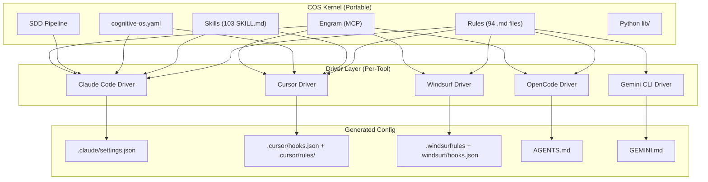

# Cross-Runtime Portability Architecture

How COS works across multiple AI coding tools — not just Claude Code.

## Executive Summary

COS is 80% portable today. The kernel (rules, skills, SDD pipeline, Engram/MCP, Python libs, cognitive-os.yaml) has zero vendor coupling. The remaining 20% — hook registration, lifecycle events, tool name matchers, and env var injection — is Claude Code-specific. This document defines the adapter architecture to close that gap.

## The 80/20 Split

### Portable Today (80%)

| Component | Count | Coupling | Notes |
|-----------|-------|----------|-------|
| Rules (markdown) | 94 files | None | Pure behavioral contracts |
| Skills (SKILL.md) | 103 files | Low | Markdown + YAML frontmatter, 16+ tools support |
| cognitive-os.yaml | 1 file | None | Universal config |
| SDD Pipeline | 8 phases | None | Workflow as skills |
| Engram (MCP) | — | None | Open protocol |
| Python lib/ | 20+ modules | None | No vendor imports |
| Pre-commit gate | 1 hook | None | Registers as git hook, not Claude hook |

### Claude Code-Specific (20%)

| Component | Issue | Fix |
|-----------|-------|-----|
| .claude/settings.json | Proprietary hook registration format | Config generator per tool |
| Hook event names | PreToolUse, PostToolUse, Stop, SessionStart, etc. | Event name mapping table |
| Tool name matchers | Bash, Agent, Edit, Write, Read, Glob, Grep | Tool name mapping table |
| Exit code protocol | 0=allow, 2=block | Already shared by Cursor |
| CLAUDE_PROJECT_DIR | Injected by Claude Code | common.sh already has fallback chain |
| .claude/rules/ auto-loading | Directory convention | ide-bridge.sh generates equivalents |
| stdin JSON schema | tool_name, tool_input structure | Schema is similar across tools |

## Architecture: Kernel + Driver Model



## The Adapter Pattern

### Canonical Hooks (shell scripts)
All hook logic lives in `.cognitive-os/hooks/` as POSIX shell scripts. These are tool-agnostic — they read JSON from stdin, process it, write JSON to stdout, and exit with a code.

### Tool-Specific Adapters
Each tool needs a thin adapter that:
1. Translates the tool's hook registration format to point at canonical scripts
2. Maps tool-specific event names to COS event names
3. Maps tool-specific tool names to COS tool names
4. Injects the correct project directory env var

### Event Name Mapping

| COS Event | Claude Code | Cursor | Windsurf | Gemini CLI |
|-----------|------------|--------|----------|------------|
| before_tool | PreToolUse | pre_tool | pre_hook | PreToolUse |
| after_tool | PostToolUse | post_tool | post_hook | PostToolUse |
| session_end | Stop | — | — | Stop |
| session_start | SessionStart | — | — | — |
| subagent_end | SubagentStop | — | — | — |
| context_compact | PreCompact | — | — | — |
| user_input | UserPromptSubmit | — | — | — |

### Tool Name Mapping

| COS Tool | Claude Code | Cursor | Notes |
|----------|------------|--------|-------|
| shell | Bash | terminal | Command execution |
| agent | Agent | — | Sub-agent launch |
| file_edit | Edit | edit | File modification |
| file_write | Write | write | File creation |
| file_read | Read | read | File reading |
| search_files | Glob | — | File pattern search |
| search_content | Grep | — | Content search |

## Existing Portability Infrastructure

### ide-bridge.sh
Already generates configs for 15 IDEs: Cursor, Windsurf, Aider, Gemini, Copilot, Codex/OpenCode, Trae, Roo, Continue.dev, Augment, Warp, Cline, Zed. Two strategies: per-file copy (Cursor, Roo, Continue) or single concatenated file (Windsurf, Cline, Trae).

### common.sh Abstraction
Project directory resolution with fallback chain:
1. `$CLAUDE_PROJECT_DIR` (Claude Code)
2. `$COGNITIVE_OS_PROJECT_DIR` (generic override)
3. `git rev-parse --show-toplevel` (fallback)
4. `pwd` (last resort)

### .cognitive-os/ vs .claude/ Separation
The OS kernel lives in `.cognitive-os/` (universal). Claude Code integration lives in `.claude/` (driver). This separation is already architecturally correct.

## Implementation Phases

| Phase | Scope | Effort | Impact |
|-------|-------|--------|--------|
| 1. AGENTS.md generation | Generate from RULES-COMPACT.md | 1-2 days | Tier 3 coverage for 9+ tools |
| 2. Hook adapters (Cursor + Windsurf) | Config generators + event mapping | 3-4 days | Tier 2 coverage for 2 more tools |
| 3. MCP config templates | Generate .cursor/mcp.json, .kiro/mcp.json, etc. | 1-2 days | Engram everywhere |
| 4. Pipeline runner (external) | Tool-agnostic Python CLI orchestration | 5-7 days | Workflows work with any CLI tool |
| 5. Cross-tool test suite | Validate COS on Cursor + OpenCode | 2-3 days | Confidence |

## Git Submodules in Worktrees

**Problem**: Submodule `.git` files use relative paths (`gitdir: ../../../.git/modules/...`) that break in worktrees because the worktree is at a different filesystem depth than the main repo.

**Symptom**: `git status` fails with:
```
fatal: not a git repository: .claude/plugins/hermes-agent/../../../.git/modules/.claude/plugins/hermes-agent
```

**Fix**: Rewrite submodule `.git` files with absolute paths pointing to the main repo's `.git/modules/` directory.

**Status**: Known git limitation. Claude Code issue anthropics/claude-code#27201 (closed without fix). The `hooks/worktree-submodule-fix.sh` SessionStart hook handles this automatically.

## What Cannot Be Ported

| Feature | Why | Degradation Strategy |
|---------|-----|---------------------|
| Agent Teams (multi-agent orchestration) | Claude Code exclusive feature | Falls back to sequential execution |
| SubagentStart/Stop hooks | Only Claude Code has subagent lifecycle | No equivalent; governance skipped |
| PreCompact hook | Only Claude Code signals context compression | No equivalent; checkpointing manual |
| UserPromptSubmit hook | Only Claude Code + Cursor have this | No input validation in other tools |
| Auto-chain SDD pipeline | Requires in-session Agent tool | Use pipeline-runner (external) instead |
| CronCreate scheduling | Claude Code session-only, in-memory | Use portable alternatives (see below) |

### Scheduling / Recurring Tasks

`CronCreate` is a Claude Code native tool that creates scheduled tasks within the current session. It is **not portable** — it has no equivalent in Cursor, Windsurf, or Kiro, and tasks die when the session ends.

| Mechanism | Provider | Persists across sessions | Survives reboots | Independent of Claude Code |
|-----------|----------|--------------------------|-----------------|---------------------------|
| `CronCreate` | Claude Code (native) | No (session-only, in-memory) | No | No |
| Scheduled Tasks (durable) | Claude Code (Scheduled Tasks MCP) | Yes (files persist on disk but tasks do not auto-resume without Claude Code running) | No | No (requires Claude Code runtime) |
| `singularity.py daemon` | COS (Python) | Yes (OS process) | No | Yes |
| System crontab | OS | Yes | Yes | Yes |
| launchd (macOS) / systemd (Linux) | OS | Yes | Yes (survives reboot) | Yes |

For critical, long-running scheduling (Singularity MAPE-K loop, periodic KPI checks), always prefer the portable alternatives. `CronCreate` is acceptable for one-off session experiments but must not be used as the sole scheduling mechanism for production workflows.

> For detailed setup examples for each scheduling option, see [`docs/singularity.md#scheduling-options`](../singularity.md#scheduling-options).

Each feature has a graceful degradation: COS detects the tool via env vars and silently disables unsupported features rather than failing.

## Decision Records

**ADR-001: AGENTS.md as universal instruction format**
- Decision: Generate AGENTS.md from RULES-COMPACT.md for cross-tool portability
- Rationale: 14+ tools read it natively; it's under Linux Foundation governance
- Consequence: Must keep AGENTS.md < 4KB (ETH Zurich finding: large instruction files reduce success)

**ADR-002: Adapter pattern over abstraction layer**
- Decision: Keep hook scripts identical; only adapter configs differ per tool
- Rationale: The shell scripts are already tool-agnostic (JSON stdin/stdout). Only the registration format differs.
- Consequence: One config generator script per target tool

**ADR-003: Pipeline runner as the portability escape hatch**
- Decision: Build external Python orchestration that wraps any AI CLI tool
- Rationale: Internal orchestration (Agent tool, sub-agents) is tool-specific. External orchestration (subprocess) is universal.
- Consequence: COS supports two execution models: internal (Claude Code-native) and external (any tool)
