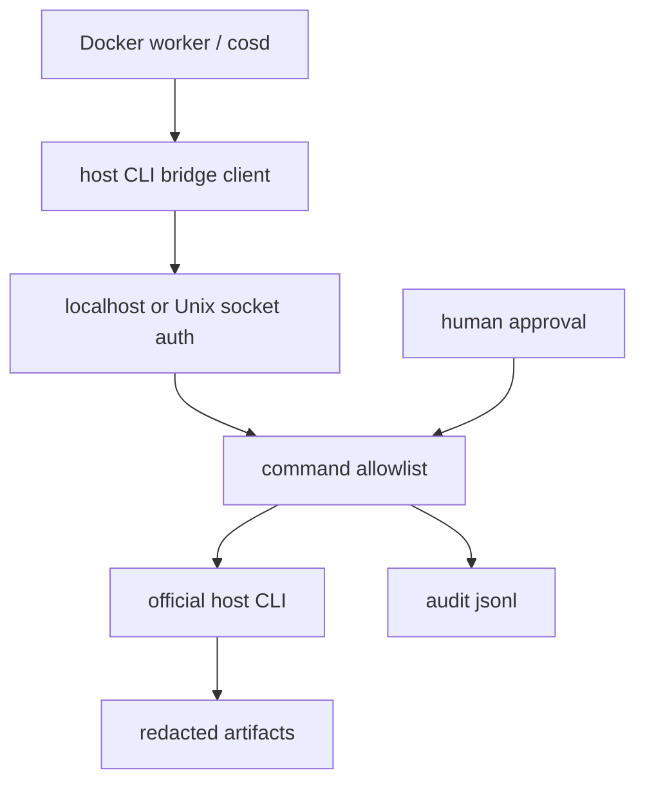

# Host CLI Bridge Security Boundary

## Why this exists

The Docker/headless service proof showed the right default: a container worker
can run Cognitive OS queue/lease/artifact tasks, but it does not inherit the
host machine's Codex or Claude Code account sessions. To use official host CLIs
safely from a service runtime, COS needs a narrow host bridge rather than copied
credential folders.

## Boundary

The bridge is not a shell. It accepts command IDs, validates auth, checks the
allowlist, enforces approval when needed, runs an official CLI, redacts output,
and writes audit/evidence.

## Phase order

1. **Contract only** — `manifests/host-cli-bridge-contract.yaml` and contract
   tests. No runtime bridge.
2. **Non-provider smoke** — bridge starts locally, rejects unauthenticated
   requests, rejects unknown commands, and runs harmless commands such as
   `codex login status` or `claude --version`.
3. **Provider smoke** — only after explicit opt-in, human approval, ready
   `auth_probe`, cost disclosure, output redaction, and artifact bundle.
4. **Docker/cosd integration** — Docker worker can request bridge execution
   without mounting credential stores.
5. **Remote ingress integration** — Telegram/Paperclip/GitHub/REST can enqueue
   tasks that eventually use the bridge only through queue/approval gates.

## Deny-by-default rules

- No arbitrary command execution.
- No remote bind by default.
- No provider calls without human approval.
- No direct push/merge/publish from bridge output.
- No reading/copying/mounting provider credential stores.
- No raw stdout/stderr persistence before redaction.

## Required audit row

Every bridge request writes `.cognitive-os/metrics/host-cli-bridge.jsonl` with:

- `timestamp`
- `request_id`
- `task_id`
- `command_id`
- `provider_call`
- `cost_bearing`
- `approval_id`
- `exit_code`
- `redaction_count`
- `artifact_dir`

## Relationship to provider adapters

The host bridge is a transport/execution boundary. It does not replace provider
adapters. Codex, Claude, Gemini, OpenCode, or future CLIs still need adapter
metadata, auth probes, cost mode, output parsing, and proof levels.
