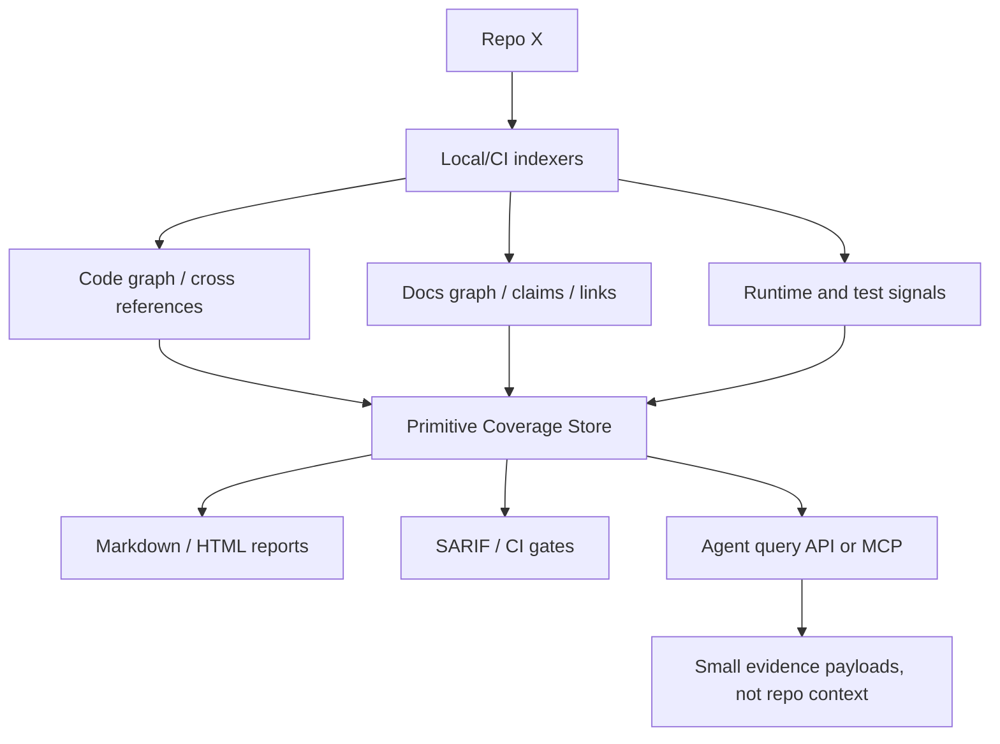

# Primitive Coverage Tooling Research — 2026-04-30

## Executive Summary

The target is **not** another agent that reads an entire repository into context.
The target is a repo-indexing and audit layer that behaves like test coverage,
but for agentic and operational primitives: skills, hooks, rules, workflows,
configs, docs, APIs, scripts, prompts, and runtime signals.

Research conclusion:

- No reviewed tool provides turnkey "coverage for agentic primitives" across
  skills/hooks/rules/docs out of the box.
- The ecosystem already has strong building blocks: code intelligence indexes,
  AST/static-analysis engines, docs-as-code tooling, API-governance tools,
  coverage/reporting infrastructure, and emerging MCP/code-graph servers.
- Cognitive OS should implement a thin **Primitive Coverage Layer** on top of
  these tools instead of inventing every scanner from scratch.
- The agent should query a compact evidence store, not the whole codebase.

## Problem Statement

Classic test coverage answers: "which lines/functions/branches are exercised by
our tests?"

Primitive coverage should answer:

- Which primitives exist in repo X?
- Which are declared but not wired?
- Which are wired but never seen at runtime?
- Which have docs claims but no proof?
- Which are referenced only by docs, only by tests, or by real runtime entrypoints?
- Which docs are duplicated, stale, unowned, or detached from implementation?
- Which new PRs increase primitive surface without proportional evidence?
- What minimal evidence should an agent receive instead of reading the repo?

## Non-Goal

Do not load a large repository into an agent context window. The indexer should
run locally or in CI and persist results as JSON/SARIF/SQLite/graph data. Agents
should retrieve only relevant rows and proof links.

## Desired Model



## Primitive Coverage Schema

Each row should normalize diverse repo objects into one evidence model:

```json
{
  "primitive_id": "hook:pre-commit-gate",
  "family": "hook",
  "path": "hooks/pre-commit-gate.sh",
  "declared": true,
  "registered": true,
  "referenced_by": [".claude/settings.json", "tests/unit/test_registered_hook_behaviors.py"],
  "runtime_seen": false,
  "tested": true,
  "documented": true,
  "owner": null,
  "claims": ["blocks unsafe commits"],
  "proof_links": ["tests/unit/test_registered_hook_behaviors.py"],
  "status": "partial",
  "next_action": "add runtime event proof"
}
```

Core fields:

| Field | Meaning |
|---|---|
| `declared` | Exists in a canonical registry/catalog/manifest. |
| `registered` | Wired to runtime/config/router/catalog. |
| `referenced_by` | Static consumers across code, docs, tests, workflows, configs. |
| `runtime_seen` | Observed in logs/traces/metrics. |
| `tested` | Behavior test exists, not just file-existence test. |
| `documented` | Has discoverable docs and usage instructions. |
| `owner` | Human/team/adapter/package owner. |
| `claims` | Product or docs claims tied to the primitive. |
| `proof_links` | Tests, metrics, traces, specs, or demos backing claims. |
| `status` | `real`, `partial`, `dormant`, `aspirational`, `orphan`, `deprecated`. |
| `next_action` | Harden, wire, document, demote, archive, or delete. |

## Tooling Landscape

### 1. Code Intelligence and Cross-Reference Indexes

These are the best fit for "do not put repo in context" because they create a
queryable structural map outside the model window.

| Tool | What it gives | Fit for primitive coverage | Notes |
|---|---|---|---|
| [SCIP](https://scip-code.org/) | Language-agnostic source indexing protocol for definitions/references. | High | Good substrate for symbol/reference graph. |
| [Sourcegraph precise code navigation / SCIP](https://sourcegraph.com/docs/code-search/code-navigation/precise_code_navigation) | Hosted/local code intelligence using SCIP indexes. | High | Strong UX and code search model. |
| [Kythe](https://kythe.io/docs/) | Language-agnostic protocols/data formats for source information as data. | High | More complex, robust semantic graph model. |
| [OpenGrok](https://opengrok.github.io/) | Source search and cross-reference engine. | Medium | Mature source browsing/search; less primitive-aware. |
| [Tree-sitter](https://github.com/tree-sitter/tree-sitter) | Incremental parsing and concrete syntax trees. | High | Good for custom multi-language primitive extractors. |
| [Joern](https://docs.joern.io/) | Code Property Graph and query DSL. | Medium/High | Strong for security/data-flow patterns; heavier. |
| [jQAssistant](https://github.com/jqassistant) | Scans software artifacts into a graph for architecture/software analytics. | Medium | Useful precedent for graph-backed architecture rules. |

Recommendation: start with Tree-sitter plus optional SCIP import. Add Kythe or
Joern only when semantic precision is needed.

### 2. Static Analysis and Custom Rules

These tools express "gap" predicates: declared-but-unwired, claim-without-proof,
new primitive-without-owner, forbidden docs wording, etc.

| Tool | What it gives | Fit | Notes |
|---|---|---|---|
| [CodeQL](https://codeql.github.com/docs) | Query code as data; custom queries; GitHub code scanning integration. | High for supported languages | Powerful, but query authoring is heavier. |
| [Semgrep](https://semgrep.dev/docs/) | Pattern/rule-based static analysis across many languages. | High | Fast path for PR gates and custom rules. |
| [ast-grep](https://ast-grep.github.io/) | AST structural search/rewrite. | High | Good middle ground: more precise than regex, lighter than CodeQL. |
| [SonarQube quality gates](https://docs.sonarsource.com/sonarqube-server/latest/quality-standards-administration/managing-quality-gates/introduction-to-quality-gates/) | Quality gates, maintainability, duplication, coverage ingestion. | Medium | Good dashboard/gate reference, not primitive-specific. |

Recommendation: use Semgrep/ast-grep for fast custom primitive rules; use
CodeQL where language-specific semantic queries matter.

### 3. Coverage and CI Reporting Infrastructure

These do not understand primitives, but they define the product UX to emulate:
PR comments, deltas, gates, badges, historical trends.

| Tool | Useful pattern |
|---|---|
| [Codecov PR comments](https://docs.codecov.com/docs/pull-request-comments) | Explain coverage delta directly on PRs. |
| [Coveralls](https://docs.coveralls.io/) | Coverage history and CI upload model. |
| [Code Climate Maintainability](https://docs.codeclimate.com/docs/maintainability) | Repository-level quality score and debt framing. |
| [GitHub SARIF code scanning](https://docs.github.com/code-security/secure-coding/sarif-support-for-code-scanning) | Standard format for findings, annotations, and code scanning UI. |

Recommendation: emit JSON for internal state, Markdown for humans, SARIF for PR
annotations, and optionally a Codecov-like delta comment.

### 4. Documentation Coverage and Drift Tooling

Docs gaps are not one thing. They include missing docs, stale links, duplicated
prose, untested examples, style drift, missing API descriptions, and claims with
no proof.

| Tool | What it gives | Fit |
|---|---|---|
| [Backstage TechDocs](https://backstage.io/docs/next/features/techdocs/) | Docs-as-code tied to software catalog entities. | High for org/catalog docs. |
| [Vale](https://vale.sh/) | Prose/style linting with custom rules. | High for claim language and style gates. |
| [markdownlint-cli2](https://github.com/DavidAnson/markdownlint-cli2) | Markdown linting. | Medium/high for hygiene. |
| [lychee](https://github.com/lycheeverse/lychee) | Broken link checker for Markdown/HTML/etc. | High for link integrity. |
| [Sphinx coverage builder](https://www.sphinx-doc.org/en/master/usage/extensions/coverage.html) | API documentation coverage in Sphinx projects. | High for Python/Sphinx docs. |
| [interrogate](https://interrogate.readthedocs.io/) | Python docstring coverage. | Medium; language-specific. |
| [docstr-coverage](https://docstr-coverage.readthedocs.io/) | Python docstring coverage. | Medium; language-specific. |
| [pytest-codeblock](https://pytest-codeblock.readthedocs.io/en/dev/) | Executes code examples in Markdown/reStructuredText. | High for executable docs. |
| [rundoc](https://eclecticiq.github.io/rundoc/) | Runs code blocks from Markdown. | Medium/high for docs examples. |

Recommendation: for primitive docs, combine:

- docs inventory and ownership;
- duplicate/staleness detection;
- link checking;
- proof-required language rules;
- executable code-block tests where practical.

### 5. API Contract and Docs Governance

For repos with APIs, API specs are themselves primitives. They need coverage
against implementation and docs.

| Tool | What it gives | Fit |
|---|---|---|
| [Spectral](https://stoplight.io/open-source/spectral) | OpenAPI/AsyncAPI/JSON/YAML linting with custom style guides. | High. |
| [Redocly CLI](https://redocly.com/docs/cli/) | OpenAPI linting, validation, bundling, docs generation. | High. |
| [oasdiff](https://www.oasdiff.com/) | OpenAPI diff and breaking-change detection. | High. |
| [SwaggerHub API Governance](https://support.smartbear.com/swaggerhub/docs/en/manage-resource-access/api-governance.html) | API governance rules and custom rules. | Medium/high, commercial. |

Recommendation: model API specs/endpoints as primitive families:
`api_spec`, `endpoint`, `client`, `contract_test`, `api_doc`.

### 6. Emerging Agent/MCP Code Graph Tools

These are closest to the user's premise: index once, give agents precise slices.
Maturity varies; evaluate before adopting as core.

| Tool / paper | What it suggests |
|---|---|
| [jcodemunch-mcp](https://github.com/jgravelle/jcodemunch-mcp) | Tree-sitter AST parsing, blast radius, dead code, untested symbols, signal chains, MCP access. |
| [tree-sitter-analyzer](https://github.com/aimasteracc/tree-sitter-analyzer) | Multi-language Tree-sitter CLI/MCP analysis framework. |
| [mcp-server-tree-sitter](https://github.com/wrale/mcp-server-tree-sitter) | MCP server exposing Tree-sitter code analysis capabilities. |
| [code-graph-rag](https://github.com/vitali87/code-graph-rag) | Multi-language Tree-sitter knowledge graph and codebase querying/editing. |
| [Repository Intelligence Graph](https://arxiv.org/abs/2601.10112) | Deterministic graph for LLM code assistants with dependency and coverage edges. |
| [Codebase-Memory](https://arxiv.org/abs/2603.27277) | Persistent Tree-sitter knowledge graph via MCP to reduce token use. |
| [AST-derived Graph RAG paper](https://arxiv.org/abs/2601.08773) | Evidence that deterministic AST-derived graph retrieval can outperform naive context loading patterns. |

Recommendation: evaluate one MCP graph tool as a retrieval backend, but keep the
Primitive Coverage schema independent so COS can swap backends.

## Source Inventory Reviewed

The research sampled more than 30 sources across official docs, GitHub projects,
and papers. Key sources:

1. SCIP — <https://scip-code.org/>
2. Sourcegraph precise code navigation — <https://sourcegraph.com/docs/code-search/code-navigation/precise_code_navigation>
3. Kythe docs — <https://kythe.io/docs/>
4. Kythe overview — <https://kythe.io/docs/kythe-overview.html>
5. OpenGrok — <https://opengrok.github.io/>
6. Tree-sitter — <https://github.com/tree-sitter/tree-sitter>
7. Joern docs — <https://docs.joern.io/>
8. Joern Code Property Graph — <https://docs.joern.io/code-property-graph/>
9. CodeQL docs — <https://codeql.github.com/docs>
10. CodeQL custom queries — <https://codeql.github.com/docs/writing-codeql-queries/about-codeql-queries/>
11. Semgrep docs — <https://semgrep.dev/docs/>
12. Semgrep rule writing — <https://semgrep.dev/docs/writing-rules/overview>
13. ast-grep — <https://ast-grep.github.io/>
14. SonarQube quality gates — <https://docs.sonarsource.com/sonarqube-server/latest/quality-standards-administration/managing-quality-gates/introduction-to-quality-gates/>
15. Codecov PR comments — <https://docs.codecov.com/docs/pull-request-comments>
16. Coveralls docs — <https://docs.coveralls.io/>
17. Code Climate maintainability — <https://docs.codeclimate.com/docs/maintainability>
18. GitHub SARIF code scanning — <https://docs.github.com/code-security/secure-coding/sarif-support-for-code-scanning>
19. SARIF specification — <https://docs.oasis-open.org/sarif/sarif/v2.1.0/os/sarif-v2.1.0-os.pdf>
20. Backstage TechDocs — <https://backstage.io/docs/next/features/techdocs/>
21. Backstage TechDocs how-to — <https://backstage.io/docs/features/techdocs/how-to-guides>
22. Vale — <https://vale.sh/>
23. GitLab Vale docs testing — <https://docs.gitlab.com/development/documentation/testing/vale/>
24. markdownlint-cli2 — <https://github.com/DavidAnson/markdownlint-cli2>
25. GitHub markdownlint rules — <https://github.com/github/markdownlint-github>
26. lychee — <https://github.com/lycheeverse/lychee>
27. lychee GitHub Action — <https://github.com/lycheeverse/lychee-action>
28. Sphinx coverage builder — <https://www.sphinx-doc.org/en/master/usage/extensions/coverage.html>
29. interrogate — <https://interrogate.readthedocs.io/>
30. docstr-coverage — <https://docstr-coverage.readthedocs.io/>
31. pytest-codeblock — <https://pytest-codeblock.readthedocs.io/en/dev/>
32. rundoc — <https://eclecticiq.github.io/rundoc/>
33. Spectral — <https://stoplight.io/open-source/spectral>
34. Redocly CLI — <https://redocly.com/docs/cli/>
35. oasdiff — <https://www.oasdiff.com/>
36. SwaggerHub API Governance — <https://support.smartbear.com/swaggerhub/docs/en/manage-resource-access/api-governance.html>
37. jcodemunch-mcp — <https://github.com/jgravelle/jcodemunch-mcp>
38. tree-sitter-analyzer — <https://github.com/aimasteracc/tree-sitter-analyzer>
39. mcp-server-tree-sitter — <https://github.com/wrale/mcp-server-tree-sitter>
40. code-graph-rag — <https://github.com/vitali87/code-graph-rag>
41. Repository Intelligence Graph — <https://arxiv.org/abs/2601.10112>
42. Codebase-Memory — <https://arxiv.org/abs/2603.27277>
43. Reliable Graph-RAG for Codebases — <https://arxiv.org/abs/2601.08773>

## Proposed Primitive Coverage Architecture

```text
primitive-coverage/
  adapters/
    cognitive-os.yaml
    claude-code.yaml
    codex.yaml
    github-actions.yaml
    backstage.yaml
    openapi.yaml
    generic-repo.yaml
  indexers/
    tree_sitter.py
    scip_import.py
    markdown.py
    docs_claims.py
    runtime_logs.py
    tests.py
    workflows.py
  rules/
    primitive_declared_but_unwired.yml
    claim_without_proof.yml
    doc_duplicate.yml
    runtime_not_seen.yml
    missing_owner.yml
  reports/
    markdown.py
    json.py
    sarif.py
    pr_comment.py
  store/
    primitive_coverage.sqlite
```

### Command UX

```bash
primitive-coverage scan .
primitive-coverage report --format markdown
primitive-coverage ci --fail-new-gaps
primitive-coverage query --family hooks --status partial
primitive-coverage query --docs --claims-without-proof
primitive-coverage explain hook:pre-commit-gate
```

### CI Outputs

- `primitive-coverage.json`: full machine-readable state.
- `primitive-coverage.md`: human summary.
- `primitive-coverage.sarif`: PR annotations and GitHub code scanning.
- `primitive-coverage-history.jsonl`: trend line over time.
- Optional PR comment: "primitive coverage changed from 74% → 71%; new gaps: 3".

## Coverage Dimensions

| Dimension | Question | Example signal |
|---|---|---|
| Declaration coverage | Is it listed in a canonical registry? | catalog/manifest/settings entry. |
| Wiring coverage | Can runtime reach it? | hook config, skill catalog, workflow job, router. |
| Consumer coverage | Who references it? | code refs, docs refs, tests, workflows. |
| Runtime coverage | Did it actually execute? | logs/traces/metrics. |
| Behavior-test coverage | Is behavior proven? | tests that assert outcome, not existence. |
| Documentation coverage | Is it documented and discoverable? | docs links/catalog/owner. |
| Claim-proof coverage | Are strong claims backed? | test, metric, trace, manual proof. |
| Freshness coverage | Are docs/specs stale? | modified time, changed implementation, broken links. |
| Owner coverage | Who owns it? | CODEOWNERS/frontmatter/catalog owner. |
| DX coverage | Can a human run/debug it? | help, examples, dry-run, errors. |

## Scoring Proposal

Primitive coverage should not be a single misleading percentage only. Use a
score plus dimensions:

```text
Primitive Coverage Score =
  20% declaration
  20% wiring
  15% behavior tests
  15% runtime evidence
  10% docs discoverability
  10% claim proof
   5% ownership
   5% DX/runbook evidence
```

Report both:

- global score;
- family score: hooks, skills, rules, docs, workflows, APIs;
- regression score: only what changed in the PR.

## How This Maps to Current COS Work

Existing COS scripts are early domain-specific versions of the Primitive Coverage
Layer:

| Current COS script | Generalized role |
|---|---|
| `scripts/primitive_gap_snapshot.py` | Family-level primitive coverage summary. |
| `scripts/primitive_row_audit.py` | Row-level primitive status classifier. |
| `scripts/claim_proof_audit.py` | Docs claim-to-proof scanner. |
| `scripts/docs_duplicate_audit.py` | Documentation duplicate drift scanner. |
| `scripts/reduction_backlog.py` | Gap-to-action backlog compiler. |
| `scripts/primitive_usage_map.py` | Static consumer map across primitive families. |
| `scripts/primitive_surface_reduce.py` | Conservative physical surface reducer. |

The next step is to extract these into a harness-agnostic `primitive-coverage`
package with adapters.

## Recommended Implementation Plan

### Phase 1 — Local deterministic scanner

- Keep current COS scanners.
- Add adapter manifest schema for primitive families.
- Emit one normalized `primitive-coverage.json`.
- Emit Markdown and SARIF.
- Gate on "no new high gaps".

### Phase 2 — Structural backend

- Add Tree-sitter extraction for symbols/imports/entrypoints.
- Add Semgrep/ast-grep rules for common primitive patterns.
- Add docs graph: links, headings, claims, owners, examples.
- Add runtime log importer.

### Phase 3 — Agent query surface

- Add CLI query commands.
- Add MCP server or connector for agent retrieval.
- Return compact evidence rows, not source files.
- Add "why is this primitive partial?" explanations.

### Phase 4 — Multi-repo / org mode

- Add Backstage catalog integration.
- Add OpenAPI/Spectral/oasdiff adapter.
- Add per-team ownership and trend dashboards.
- Add PR comments and regression history.

## Immediate Tool Choices

Recommended initial stack:

1. **Tree-sitter** for language-agnostic AST inventory.
2. **Semgrep or ast-grep** for custom gap rules.
3. **SARIF** for GitHub PR/code-scanning display.
4. **Vale + lychee + markdownlint-cli2 + pytest-codeblock** for docs hygiene.
5. **Spectral + oasdiff** for API primitive families.
6. **SQLite/JSONL** as the first storage layer before adding graph DB complexity.

Avoid making Sourcegraph/Kythe/Joern mandatory at first; keep them optional
backends for large repos or high-semantic-precision environments.

## Open Questions

1. What primitive families should be first-class outside COS?
2. Should docs claims be classified by LLM, rules, or both?
3. What is the minimum evidence threshold before a primitive can be called "real"?
4. Which findings should block CI versus only show as advisory?
5. Should runtime evidence expire after N days?
6. How should generated/third-party/vendor files be excluded?
7. What is the default graph backend: JSON, SQLite, property graph, or MCP index?

## Decision Recommendation

Build `primitive-coverage` as a product capability of Cognitive OS:

- **Not** a replacement for test coverage.
- **Not** a giant context loader.
- **Yes** a coverage/gap layer over repo primitives, docs, and runtime evidence.
- **Yes** an agent retrieval system that returns exact evidence slices.
- **Yes** compatible with existing tools through adapters and SARIF/JSON output.

This gives COS a defensible capability: preventing the "monster repo" failure mode
by proving which primitives are real, wired, tested, documented, and observed.
