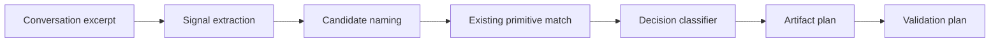

# Primitive Harvester Architecture

The primitive harvester is an advisory meta-primitive that detects when a
conversation should become a durable Cognitive OS agentic primitive.

## Flow

## Inputs

- `--text`: short conversation excerpt.
- `--conversation-file`: captured conversation/session text.
- `--repo`: repository whose existing skills, scripts, and hooks are used for
  duplicate detection.

## Outputs

The script returns JSON with:

- `decision`
- `confidence`
- `candidate_name`
- `primitive_type`
- `existing_match`
- `reasons`
- `risks`
- `artifact_plan`
- `validation_plan`
- `next_action`

## Decision Semantics

| Decision | Meaning | Repository mutation |
|---|---|---|
| `CREATE_PRIMITIVE` | New reusable primitive is justified | Follow emitted plan in a governed change |
| `IMPROVE_EXISTING` | Matching primitive exists but needs extension | Patch that primitive and tests |
| `USE_EXISTING` | Matching primitive already satisfies request | Invoke it, no new artifact |
| `DOCUMENT_ONLY` | Durable decision/tradeoff, no action layer | ADR/docs only |
| `DISCARD` | Insufficient repeatability/value/verification | No artifact |

## Existing Primitive Matching

The harvester scans:

- `skills/*/SKILL.md`
- `scripts/cos_*.py`
- `hooks/*.sh`

It tokenizes names and compares them against the inferred candidate and the
conversation. High-similarity matches prevent duplicate primitive creation.

## Safety Boundaries

- No files are created by the harvester.
- No hooks are registered by the harvester.
- No cleanup, Git mutation, or push is performed by the harvester.
- Generated plans must still be implemented with tests and landed through the
  governed merge queue.

## Known Limits

The first implementation is heuristic and deterministic. It intentionally favors
safe false negatives over noisy primitive creation. Future work may add Engram
session summaries, stronger semantic matching, or a review UI, but mutation must
remain explicit.
