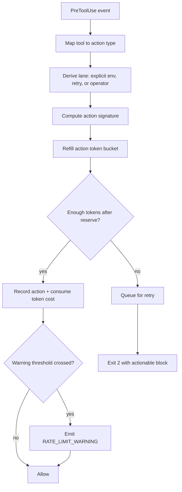

# Rate Limiter Flow Control

<!-- SCOPE: both -->

## Purpose

The rate limiter protects Cognitive OS from runaway tool-call cascades while preserving enough burst capacity for legitimate operator and multi-agent work.

It is not a scheduler. It is a local flow-control guard around hook activity, queue retries, and action-count pressure.

## Runtime model



## State

`lib/rate_limiter.py` persists state in `.cognitive-os/rate-limit-state.json`.

The state is protected with a per-state-file flock during record/reset writes so concurrent hook processes do not corrupt or lose persisted events.

The state includes:

- legacy timestamp lists for each action type;
- token buckets keyed by action type;
- recent action signatures for diversity/loop detection;
- hourly cost counters.

Queue state remains separate in `.cognitive-os/rate-limit-queue.jsonl` and is still owned by `RateLimitQueue`. The PostToolUse drainer releases queued items once cooldown elapses; safe Bash commands can be executed directly and audited in `.cognitive-os/rate-limit-executed.jsonl`.

## Configuration knobs

All knobs live on `RateLimitConfig` and can be projected from `security.rate_limits` when config loading is extended further.

| Knob | Default | Meaning |
|---|---:|---|
| `burst_multiplier` | `1.5` | Bucket capacity multiplier over phase-adjusted refill limit. |
| `warning_threshold` | `0.80` | Usage ratio that emits soft warnings. |
| `operator_reserve_ratio` | `0.20` | Fraction of bucket protected from normal/orchestrator lane. |
| `diversity_penalty_threshold` | `0.80` | Dominance ratio that marks a repeated signature as loop-like. |
| `diversity_penalty_min_events` | `5` | Minimum recent signature sample before applying penalty. |
| `diversity_penalty_cost` | `2.0` | Token cost for a repeated dominant signature. |

## Lane semantics

| Lane | Who should use it | Reserve behavior |
|---|---|---|
| `operator` | Human-initiated or foreground work | May consume reserved tokens. |
| `normal` | Default library callers | Preserves reserve. |
| `orchestrator` | queued retries/background fan-out | Preserves reserve. |

`hooks/rate-limiter.sh` uses `COS_RATE_LIMIT_PRIORITY_LANE` when present. Otherwise, retries with `RATE_LIMIT_RETRY_COUNT > 0` become `orchestrator`, and fresh invocations default to `operator`.

## Loop signal

For Bash actions, the hook hashes `.tool_input.command` and passes the hash as the signature. Repeating the same command is allowed, but if the window is dominated by that signature, future matching actions cost extra tokens.

This intentionally distinguishes:

- `git status`, `git diff`, `pytest`, `git status` — diverse productive work;
- `pytest same-test` repeated in a tight loop — likely debugging pressure, drains faster;
- the exact same failing shell command repeated by automation — loop signal.

## Operational behavior

- Soft warnings are printed as `RATE_LIMIT_WARNING: ...` and do not block.
- Hard blocks still enqueue the action for automatic retry and exit `2`.
- `DISABLE_HOOK_RATE_LIMITER=true` skips the hook for a session, but the safer default is to keep it active and use the operator reserve.

## Verification

```bash
python3 -m pytest tests/unit/test_rate_limiter.py tests/unit/test_rate_limiter_behavior.py tests/unit/test_rate_limit_queue.py tests/unit/test_rate_limiter_edge_matrix.py tests/audit/test_hook_disable_env.py tests/integration/test_rate_limit_drainer_executes.py tests/integration/test_rate_limiter_hook_retry_flow.py -q
```
