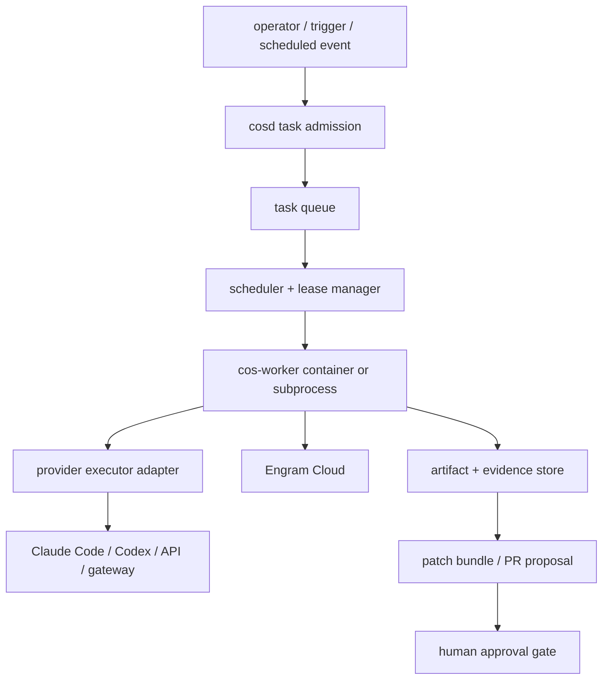

# COS Service Control Plane Implementation Plan

This plan turns the service-control-plane research into a staged build. It is
deliberately not a new product claim. It is a proof ladder for making the future
`cosd` boundary real without weakening credential safety or local DX.

## Target architecture



## Principles

1. **Propose-only first**: workers may produce patch bundles and PR proposals;
   merge/push/publish remains human-gated.
2. **No credential scraping**: the service never reads vendor token stores.
3. **Adapter isolation**: provider-specific auth, output parsing, and event
   mapping live in executor adapters.
4. **Evidence over dashboard**: every phase writes local artifacts before any
   UI/dashboard is considered.
5. **Crash visibility before autonomy**: a worker that cannot resume safely is
   not allowed to run unattended.
6. **Lab-first provider support**: Kimi, MiniMax, DeepSeek, and any new
   provider start as lab until a proof drill signs their auth and output
   contract.

## Phase 0 — Contract and proof skeleton

Goal: add the service contracts before implementing the daemon.

Artifacts:

- `manifests/service-control-plane-schema.yaml`
- `manifests/provider-executor-contracts.yaml`
- `docs/manual-tests/service-control-plane-proof-drills.md`

Acceptance criteria:

```bash
python3 - <<'PY'
from pathlib import Path
for path in [
  "manifests/service-control-plane-schema.yaml",
  "manifests/provider-executor-contracts.yaml",
  "docs/manual-tests/service-control-plane-proof-drills.md",
]:
    assert Path(path).exists(), path
PY
```

## Phase 1 — Local `cosd` minimal queue

Goal: implement a local-only control plane with no model calls.

Shape:

```text
scripts/cosd
scripts/cos-task-submit
scripts/cos-worker-run-once
scripts/cos-queue-drain
.cognitive-os/service/queue.jsonl
.cognitive-os/service/leases.jsonl
.cognitive-os/service/artifacts/
```

Initial queue can be SQLite or append-only JSONL. JSONL is acceptable for the
first local proof if it has atomic append, lease expiry, and idempotent task
IDs.

Acceptance criteria:

- submit a no-op task;
- claim it once;
- reject duplicate claim while lease is active;
- expire lease after configured TTL;
- write an artifact bundle with `task.json`, `lease.json`, `result.json`, and
  logs.

## Phase 2 — Worker execution surface

Goal: run a bounded worker against a temporary repository.

Worker must:

- allocate a temp workspace or worktree;
- receive one task payload;
- run a deterministic no-model command first;
- produce patch/evidence output;
- clean up by default;
- support `--keep` for debugging.

No provider credentials are required in this phase.

Acceptance criteria:

```bash
scripts/cos-task-submit --kind local-command --command 'printf ok > result.txt'
scripts/cos-worker-run-once --executor local-command --json
scripts/cos-queue-drain --json
```

## Phase 3 — Provider executor adapters

Goal: invoke account-backed or API-backed provider runtimes through explicit
adapters.

Initial adapters:

| Adapter | First proof | Credential mode |
|---|---|---|
| `local-command` | deterministic command | none |
| `codex-cli` | `codex exec --json` in a trusted, already-authenticated host | `account-session` or `api-key` |
| `claude-cli` | official `claude` invocation in a trusted, already-authenticated host | `account-session`, `oauth-token`, `api-key`, or `provider-cloud` |
| `proxy-gateway` | enterprise/local gateway smoke | `proxy-gateway` |

Later lab adapters:

- `kimi`
- `minimax`
- `deepseek`

Required command:

```bash
scripts/cos-auth-probe --provider codex --mode account-session --json
```

Required statuses:

- `ready`
- `auth_required`
- `unsupported`
- `unsafe`

Acceptance criteria:

- auth probes never print token material;
- account-backed probes do not read credential files directly;
- missing auth returns `auth_required`, not a stack trace;
- provider stdout/stderr is redacted before artifact persistence;
- provider adapters can run in `dry_run` without model calls.

## Phase 4 — Crash/resume and WIP safety

Goal: make failed headless tasks recoverable.

Required behavior:

- lease heartbeat;
- stale-lease requeue;
- artifact append-only logs;
- worker crash leaves enough evidence to resume or mark `needs_human`;
- WIP never disappears into a hidden stash;
- no task can publish output after lease expiry.

Acceptance criteria:

- kill worker mid-task;
- rerun `cos-worker-run-once`;
- task is either resumed safely or marked `needs_human`;
- evidence explains why.

## Phase 5 — PR/propose-only output

Goal: let the service create reviewable proposals without autonomous merge.

Allowed outputs:

- `patch.diff`
- branch in a temp/fork namespace;
- draft PR;
- artifact bundle URL/path;
- summary with validation evidence.

Blocked outputs:

- direct push to protected `main`;
- `git push --force`;
- merge without human approval;
- publishing credentials, logs with secrets, or raw provider auth files.

Acceptance criteria:

- worker opens or prepares a draft PR from a temp branch;
- PR body links evidence bundle;
- human approval is required before merge.

## Phase 6 — Compose and local Kubernetes

Goal: promote the worker from local process to service deployment.

Order:

1. Docker Compose `cosd + queue + worker + Engram Cloud`.
2. kind/k3d/minikube proof.
3. Provider overlays only after local Kubernetes proof.

Cloud providers are explicitly out of scope until local Kubernetes proves:

- readiness/liveness;
- no duplicate task execution;
- crash/restart;
- evidence persistence;
- credential redaction.

## Credential handling plan

### Local trusted host

`cosd` may invoke `codex exec` or `claude` if the operator has authenticated
the official CLI. COS must treat the CLI as a black box and never read cached
credentials.

### Container worker

Container workers cannot inherit host account auth implicitly. They need one of:

- explicit API key secret;
- official OAuth/device-login flow;
- provider cloud credentials;
- mounted credential store only if the vendor documents and permits it;
- proxy gateway credentials.

### Cloud worker

Cloud workers must use managed secrets, workload identity, provider cloud auth,
or gateway credentials. Copying a laptop's subscription credential into a cloud
container is not a supported COS posture.

## What this deliberately does not build yet

- A general multi-tenant hosted service.
- Distributed locks across multiple maintainers.
- Full Engram consensus.
- Always-on autonomous merge.
- Provider-specific hacks for unofficial account-token reuse.

Those remain Shape-B / future product decisions.

## First implementation slice

The smallest useful slice is:

```text
manifest contracts
  -> local JSONL queue
  -> local-command executor
  -> artifact bundle
  -> crash-safe lease proof
```

Only after that should `codex-cli` or `claude-cli` be attached.

