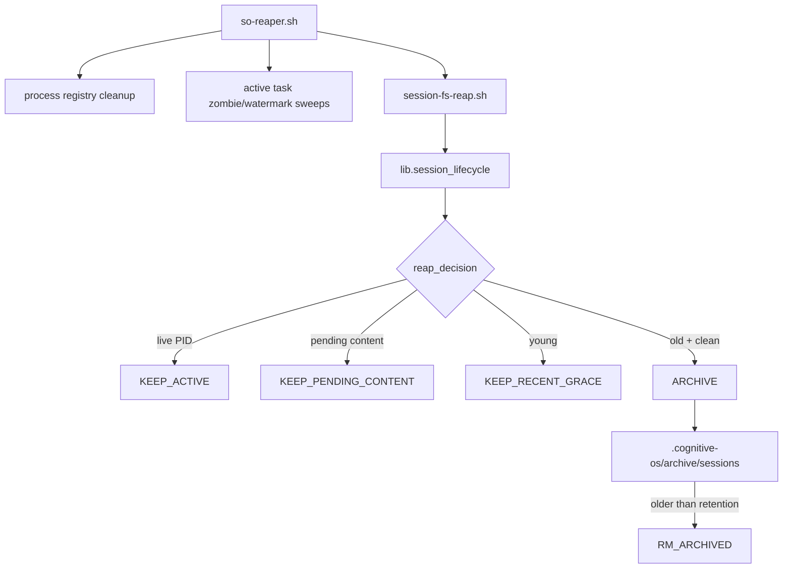

# Session Filesystem Reaper

## Purpose

The Session Filesystem Reaper closes the gap between registry cleanup and disk
cleanup. `so-reaper.sh` can clean process/task registries, and
`cos_work_inventory.py` can detect stale session volume, but stale directories
under `.cognitive-os/sessions/` need a separate archive-first action layer.

## Flow



## Commands

Dry-run JSON report:

```bash
bash hooks/_lib/session-fs-reap.sh --project-dir "$PWD" --dry-run --json
```

Normal archive-first sweep:

```bash
bash hooks/_lib/session-fs-reap.sh --project-dir "$PWD"
```

Inventory volume alarm:

```bash
python3 scripts/cos_work_inventory.py --project-dir "$PWD" --sessions --race-risks --volume-alarm-threshold 1000 --json
```

## Safety invariants

- Never remove a live session directory.
- Never archive a session with pending content.
- Never delete an unarchived session directly.
- Delete only archived sessions older than the retention window.
- Continue on individual errors; reapers must degrade safely.

## Files

- `lib/session_lifecycle.py` — decision model and filesystem operations.
- `hooks/_lib/session-fs-reap.sh` — shell wrapper used by hooks/reaper scripts.
- `scripts/so-reaper.sh` — invokes the filesystem reaper after registry/task sweeps.
- `scripts/cos_work_inventory.py` — read-only detection and aggregate volume alarm.
- `tests/behavior/test_session_fs_reap.py` — behavior coverage.
