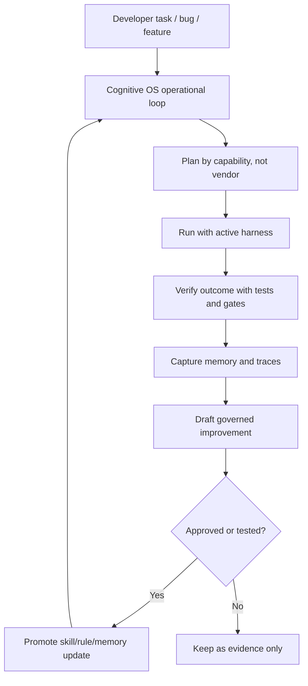

# Competitive Reassessment: OpenClaw and Hermes Agent

> Date: 2026-04-29  
> Scope: reassess OpenClaw/OpenClub-style personal-agent infrastructure and Hermes Agent against Cognitive OS after the portability, memory-lifecycle, and test-lane hardening work.  
> Principle: treat competitor claims as signals, not proof, until verified against primary or product-adjacent sources.

## Executive Read

Cognitive OS should not copy OpenClaw or Hermes Agent. Their center of gravity is different:

- **OpenClaw** is becoming a consumer/productivity personal-agent platform: persistent gateway, many chat channels, skills, community distribution, and managed VPS/onboarding paths.
- **Hermes Agent** is positioning around native self-improvement: experience capture, skill creation/update, persistent user memory, messaging gateway, and portable execution surfaces.
- **Cognitive OS** is strongest as the operational layer for engineering agents: governance, verification, portability, memory lifecycle, tests, docs, doctors, and outcome-based reliability.

The important lesson is not "become OpenClaw" or "become Hermes." The lesson is:

> Cognitive OS must make self-improvement and memory feel native while keeping the governance, verification, and portability discipline that those tools do not make central.

## Source Status

The user supplied a video transcript that claims OpenClaw is stronger for production/community/workflows, while Hermes wins on native self-improvement. Because those are current-market claims, this reassessment uses external verification where possible.

| Claim Area | Current Evidence | Confidence | Notes |
|---|---|---:|---|
| OpenClaw has large usage and public momentum | OpenRouter lists OpenClaw as a top public app by tracked token usage and GitHub currently shows a very large star/fork count for `openclaw/openclaw`. | High | Sources: OpenRouter apps ranking, OpenClaw GitHub. |
| Hermes is a self-improving agent with persistent memory and skill creation | Hermes GitHub and Hermes docs describe a built-in learning loop, autonomous skill creation/update, memory nudges, FTS5 session search, user modeling, and messaging gateways. | High | Sources: Hermes GitHub README and Hermes learning-loop docs. |
| Hermes ranks highly on OpenRouter | OpenRouter lists Hermes Agent among top coding/productivity agents by tracked token usage. | High | Source: OpenRouter apps ranking. |
| OpenClaw has one-click/managed Hostinger deployment | Hostinger and OpenClaw docs describe managed 1-click and VPS OpenClaw deployment paths. | High | Sources: Hostinger OpenClaw page, OpenClaw Hostinger docs. |
| OpenClaw has self-improvement via community skills | ClawHub and other skill directories list self-improvement skills with local learning/error/recovery capture. | Medium | The strongest signal is existence and adoption, but security scan notes and integration ambiguities mean this is not equivalent to native core behavior. |
| Exact video numbers such as download counts, star counts, and "top two in eight weeks" | Some numbers are directionally plausible from current pages, but exact transcript phrasing should not be treated as canonical without a stable source snapshot. | Medium | Avoid hardcoding exact numbers in product messaging unless captured from an official source at release time. |

## Feature Matrix

| Dimension | OpenClaw | Hermes Agent | Cognitive OS Today | Strategic Interpretation |
|---|---|---|---|---|
| Product promise | Personal AI assistant across messaging channels. | Self-improving agent that grows with the user. | Operational layer that makes coding agents governable, verifiable, and portable. | Keep COS engineering-focused; do not dilute into generic assistant UX. |
| Native self-improvement | Not core-first in the same way; available through skills and community patterns. | Core brand and core UX: observe, distill, reuse, refine. | Real agentic primitives exist: session learning, Engram lifecycle, memory scanning, feedback detection, skill guidance. But the UX still feels like separate primitives, not one obvious native mode. | COS needs a first-class governed self-improvement mode. |
| Skill creation/update | Skills ecosystem is strong; self-improvement skills can write local learnings and behavior files. | Skills can be generated/updated from experience and loaded via progressive disclosure. | Skills exist, canonical projection exists, but autonomous skill lifecycle should be more explicit and test-backed. | Build a draft/approve/promote lifecycle, not uncontrolled self-modification. |
| Memory/persona | Persistent memory and message history are product features. | Persistent memory, user modeling, session search, memory nudges. | Engram integration, memory doctors, session summaries, resume hooks, changelogs, safe memory tools. | COS is stronger on auditable memory protocol; weaker on visible personal-profile UX. |
| Multi-agent / delegation | Community and gateway flows show agent fleets and multi-channel orchestration. | Subagents, scheduled automations, gateway delivery. | Agent teams, coordination packages, worker/runtime direction, but much is engineering-internal. | COS should compare on engineering repair/build workflows, not chat-channel breadth. |
| Install/onboarding | OpenClaw has CLI onboarding, daemon install, managed/VPS paths. | `curl | bash`, CLI setup, gateway setup, cloud/serverless claims. | `cos init`, self-install, doctors, harness projection, but still more complex. | The next product win is a simple local and headless install proof path. |
| Marketplace/community | Strong community signal and skill hub. | Skills Hub / agentskills-compatible story. | Package manager and registries exist, but community distribution is not mature. | Prioritize curated proof packages over a broad marketplace. |
| Governance and quality gates | Security defaults exist, but governance is not the product center. | Self-correction and security docs exist, but verification gates are not the product center. | Trust reports, policy hooks, test discipline, doctors, path scanners, contract tests. | This is the durable wedge. Do not trade it away for flashier autonomy. |
| Provider/tool portability | Supports multiple models/providers. | Supports many model endpoints and terminal backends. | Provider/harness adapters, capability-centric direction, canonical state under `.cognitive-os/`. | COS must keep moving from model-centric to capability-centric enforcement. |
| Headless/cloud runtime | VPS/daemon/gateway are central. | VPS, gateway, serverless and cluster positioning. | Headless/cluster plan exists; runtime worker mode is not shipped yet. | Do not claim cluster-ready until `cos run-task` / worker contracts exist. |

## Where They Are Better

### OpenClaw

OpenClaw is better at visible adoption and operational packaging for non-expert users:

- chat-channel breadth;
- daemon/gateway onboarding;
- managed/VPS install story;
- public skill/community ecosystem;
- consumer-friendly examples of useful automations.

This matters because users often buy **time-to-first-use**, not architecture. Cognitive OS can be technically deeper and still lose if a new user cannot see value quickly.

### Hermes Agent

Hermes is better at making self-improvement feel native:

- self-improvement is a first-class product promise;
- the learning loop is explained as observe -> distill -> reuse -> refine;
- skills and memory are part of the normal UX, not an optional doctrine;
- the agent has commands and docs around skills, memory, gateway, and doctor;
- it presents a clear story for running outside the laptop.

This matters because Cognitive OS already has many of the ingredients, but the ingredients must become a visible loop.

## Where Cognitive OS Is Better

Cognitive OS is better positioned for engineering-agent reliability:

- governance hooks and policy engine;
- quality gates and trust reports;
- documented broken-window/test discipline;
- harness portability across Claude, Codex, and future drivers;
- canonical `.cognitive-os/` state instead of driver-specific truth;
- memory lifecycle with Engram, doctors, and session recovery;
- path portability, drift detection, and persistent test summaries;
- outcome metrics and runtime-comparison plan.

The competitive wedge is therefore:

> Cognitive OS is not the agent that does everything. It is the operating layer that makes engineering agents easier to trust, easier to verify, and harder to outgrow.

## Gaps To Close Without Becoming Aspirational

### 1. Native Governed Self-Improvement Mode

Current state: pieces exist, but the product loop is not obvious enough.

Required behavior:

1. Detect repeated failures, repeated manual corrections, and repeated successful multi-step procedures.
2. Propose a skill/rule/memory update as a draft artifact.
3. Attach evidence: session IDs, commands, tests, failures, and recovery proof.
4. Require approval before promotion unless the project explicitly opts into auto-promote.
5. Add or update a test that proves the learned behavior is reusable.

This is the safe version of Hermes-style self-improvement: native, but governed.

### 2. Skill Lifecycle Autopilot

Current state: skills exist and are projected across harnesses, but skill creation/update is not yet a single reliable loop.

Required behavior:

- `cos skill suggest` from session evidence;
- `cos skill draft` creates `SKILL.md` plus verification checklist;
- `cos skill promote` installs into canonical `.cognitive-os/skills/`;
- harness projection writes only driver-specific views;
- contract tests prove discovery, projection, invocation hints, and rollback.

### 3. Memory/Profile Bootstrap

Current state: Engram, session summaries, changelog, and resume hooks work, but profile formation is not visible enough.

Required behavior:

- first three sessions produce an explicit project profile draft;
- profile entries are scoped, source-linked, and conflict-checked;
- developer can inspect, edit, export, or wipe memory;
- no absolute user paths or secrets are persisted;
- Codex and Claude both run the same memory lifecycle proof.

### 4. One-Command Local and Headless Proof Path

Current state: doctors and install/update exist; headless/cluster direction is documented but not runtime-complete.

Required behavior:

- `cos doctor` proves local harness, memory, dependencies, path portability, and tests summary;
- `cos run-task` runs a small bug repair fixture headlessly;
- output includes patch, test result, quality gate result, memory summary, and audit trail;
- EC2/container/Kubernetes claims stay behind experimental flags until real fixtures pass.

### 5. Curated Workflow/Package Proofs

Current state: COS has packages and registries, but not an OpenClaw-like public hub.

Required behavior:

- ship a small curated catalog: bug repair, session recovery, provider switch, path-sanitization, memory bootstrap;
- every catalog item must include install, run, verify, uninstall;
- every claim must have a test or manual proof path.

## Competitive Product Decision

Cognitive OS should adopt the **native-loop clarity** of Hermes and the **low-friction deployment proof** of OpenClaw, but keep a different center:

## Roadmap Addendum

| Priority | Work Item | Proof Required |
|---:|---|---|
| P0 | Document and enforce governed self-improvement contract. | Contract test for draft -> approve -> project -> discover. |
| P0 | Add competitive benchmark fixture for Hermes/OpenClaw-style learning loops. | Runtime comparison report with vanilla vs COS outcomes. |
| P1 | Add `cos skill suggest/draft/promote` or equivalent scripts. | Unit + integration tests, no direct writes outside canonical state. |
| P1 | Add memory/profile bootstrap proof. | Codex and Claude doctors prove save/recover/profile without driver lock-in. |
| P1 | Add local headless `cos run-task` proof fixture. | Patch + tests + gates + summary artifact. |
| P2 | Build curated package/workflow catalog. | Each package has install/run/verify/uninstall tests. |
| P2 | Explore managed/VPS/container install path. | Manual test doc first, automated smoke later. |

## References

- OpenRouter app rankings: <https://openrouter.ai/apps>
- OpenClaw website: <https://openclaw.ai/>
- OpenClaw GitHub: <https://github.com/openclaw/openclaw>
- OpenClaw Hostinger docs: <https://docs.openclaw.ai/install/hostinger>
- Hostinger OpenClaw page: <https://www.hostinger.com/openclaw>
- Hermes Agent GitHub: <https://github.com/NousResearch/hermes-agent>
- Hermes learning loop docs: <https://hermes-agent.ai/features/learning-loop>
- Hermes self-improvement blog: <https://hermes-agent.ai/blog/self-improving-ai-guide>
- ClawHub self-improvement example: <https://clawhub.ai/skills/self-improver>
- Cognitive OS runtime benchmark plan: [runtime-comparison-benchmark-plan.md](../architecture/plans/runtime-comparison-benchmark-plan.md)
- Cognitive OS alternatives comparison: [vs-alternatives.md](../vs-alternatives.md)
