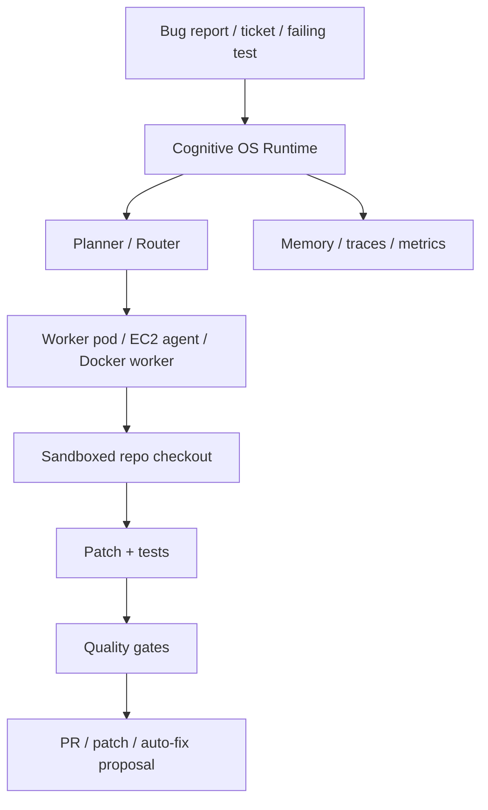

# Manual Test — Headless Docker Service Runtime

## Purpose

Prove that Cognitive OS can run in a service/headless lane without requiring the
operator to be inside an IDE. This drill validates the current Docker worker,
local queue, lease, artifact, and communication boundary. It also records what
is **not** proven yet for host Codex and Claude Code account-backed execution.

This test complements IDE harness use. It does not replace Claude Code, Codex,
Cursor, VS Code Copilot, OpenCode, or other IDE/CLI projection modes.

## Architecture under test



Current proof level: Docker worker + local-command queue execution. Provider
account-backed execution remains host-only/lab until CLI/version/auth probes are
signed.

## Preconditions

- Docker Desktop or compatible Docker daemon is running.
- `docker compose` is available.
- No provider API key is required for the default drill.
- The drill uses a disposable `git archive HEAD` workspace under `/tmp` by
  default, so unrelated dirty worktree changes are not mounted into the worker.

## Default drill command

```bash
scripts/cos-headless-service-drill --json --keep-workspace
```

Expected result:

- Docker worker `--self-test` passes.
- Host Codex/Claude probes run without COS reading credential stores.
- Container Codex/Claude probes return `unsupported`, `auth_required`, or
  `ready`; `unsupported` is acceptable because the worker image intentionally
  does not mount host CLI binaries or host token stores.
- A local-command task is submitted inside Docker.
- The worker claims a lease, executes the task, writes artifacts, and queue
  drain reports one completed task.

## Optional pytest wrapper

Default lane skips the Docker drill:

```bash
python3 -m pytest tests/integration/test_headless_service_drill.py -q
# expected: skipped unless COS_RUN_HEADLESS_SERVICE_DOCKER=1
```

Explicit Docker lane:

```bash
COS_RUN_HEADLESS_SERVICE_DOCKER=1 python3 -m pytest tests/integration/test_headless_service_drill.py -q
```

## Optional provider smoke

Provider calls are disabled by default. To run the host Codex provider smoke,
make the cost-bearing decision explicit:

```bash
COS_RUN_PROVIDER_SMOKE=1 scripts/cos-headless-service-drill --json --keep-workspace
```

If the host Codex CLI defaults to a model unsupported by the installed CLI
version, pin a supported model for the smoke:

```bash
COS_RUN_PROVIDER_SMOKE=1 COS_CODEX_EXEC_MODEL=gpt-5.4 \
  scripts/cos-headless-service-drill --json --keep-workspace
```

This calls the official host `codex` CLI through the service-control-plane
adapter when `scripts/cos-auth-probe --provider codex --mode account-session`
returns `ready`. It still does not read `~/.codex/auth.json`; the official CLI
owns its own auth.

## Evidence from 2026-05-05

### Host and container auth probes

```bash
scripts/cos-auth-probe --provider codex --mode account-session --json
# status=ready, command="codex login status", credential_store_access=forbidden

scripts/cos-auth-probe --provider claude --mode account-session --json
# status=ready when Claude Code is installed at PATH or a governed known location such as $HOME/.local/bin/claude
```

Inside Docker worker:

```bash
docker compose -f docker/cos-worker/docker-compose.yml run --rm cos-worker \
  scripts/cos-auth-probe --provider codex --mode account-session --json
# status=unsupported, reason="codex CLI not found on PATH"

docker compose -f docker/cos-worker/docker-compose.yml run --rm cos-worker \
  scripts/cos-auth-probe --provider claude --mode account-session --json
# status=ready when Claude Code is installed at PATH or a governed known location such as $HOME/.local/bin/claude
```

Interpretation: the current container **does not inherit** host Codex/Claude
account sessions. That is correct for the no-credential-scraping policy. To make
container provider execution work later, we need an explicit supported mode such
as device login, documented mounted credentials, API key, provider cloud, or a
protected host executor bridge.

### Docker local-command runtime

```bash
scripts/cos-headless-service-drill --json --keep-workspace
# ok=true
# host_codex_status=ready
# host_claude_status=ready when Claude Code is installed/authenticated on the host; otherwise unsupported
# container_codex_status=unsupported
# container_claude_status=unsupported
# local_task_status=completed
# evidence_recording.headless-docker-service-drill.exit_code=0
```

The completed task wrote artifacts under:

```text
/workspace/.cognitive-os/service/artifacts/task-headless-service-drill/<lease-id>/
```

with:

- `task.json`
- `lease.json`
- `executor.json`
- `result.json`
- `redaction-report.json`
- `logs/stdout.txt`
- `logs/stderr.txt`

### Host Codex provider smoke

A cost-bearing host Codex provider smoke was attempted with the default host
Codex model and failed because the installed Codex CLI rejected `gpt-5.5` as
requiring a newer CLI. The same smoke then passed with an explicit supported
model override:

```bash
COS_RUN_PROVIDER_SMOKE=1 COS_CODEX_EXEC_MODEL=gpt-5.4 \
  scripts/cos-headless-service-drill --json --keep-workspace
```

Result:

```text
provider_calls=1
status=completed
returncode=0
message=COS_PROVIDER_SMOKE_OK
```

The official Codex CLI was authenticated and executed through the host adapter.
The adapter redacted the prompt in `command_shape` and did not read Codex
credential stores directly.

### Host Claude provider smoke

Claude provider execution is separate from the Docker local-command proof and
remains cost-bearing. It must be opted in manually through the service-control
plane and a supported model pin:

```bash
scripts/cos-task-submit --project-dir /tmp/cos-claude-provider.<id> \
  --kind provider --executor claude-cli-host \
  --task-id task-claude-provider-proof \
  --prompt 'Reply exactly: COS_CLAUDE_PROVIDER_SMOKE_OK' --json

COS_CLAUDE_EXEC_MODEL=sonnet scripts/cos-worker-run-once \
  --project-dir /tmp/cos-claude-provider.<id> \
  --worker-id host-claude-proof --allow-provider-call --json
```

Expected evidence shape:

```text
status=completed
provider_calls=1
returncode=0
message=COS_CLAUDE_PROVIDER_SMOKE_OK
```

Record the result through `scripts/proof-drill-evidence-record` as
`claude-provider-host-smoke`; ACC maps it to
`proof_claim:host-claude-provider-adapter`.

## Current conclusion

- Proven: Docker worker boots and executes a non-model COS task through queue,
  lease, workspace, artifacts, and redaction report.
- Proven: host Codex account-session probe is ready without COS reading token
  stores.
- Proven: account-backed host Codex provider execution works through the service
  adapter when `COS_RUN_PROVIDER_SMOKE=1` and `COS_CODEX_EXEC_MODEL` pins a
  model supported by the installed CLI.
- Proven: account-backed host Claude provider execution works through the service
  adapter when `--allow-provider-call` is explicit and `COS_CLAUDE_EXEC_MODEL`
  pins a model supported by the installed CLI.
- Proven negative: Docker worker does not automatically inherit host Codex or
  Claude Code account sessions.
- Not proven: Claude or Codex provider execution inside the container, remote
  ingress, VM, Kubernetes, or protected host-cli bridge execution.

## Cleanup

If `--keep-workspace` was used, remove the printed `/tmp/cos-headless-service.*`
workspace after collecting evidence:

```bash
rm -rf /tmp/cos-headless-service.<id>
```
